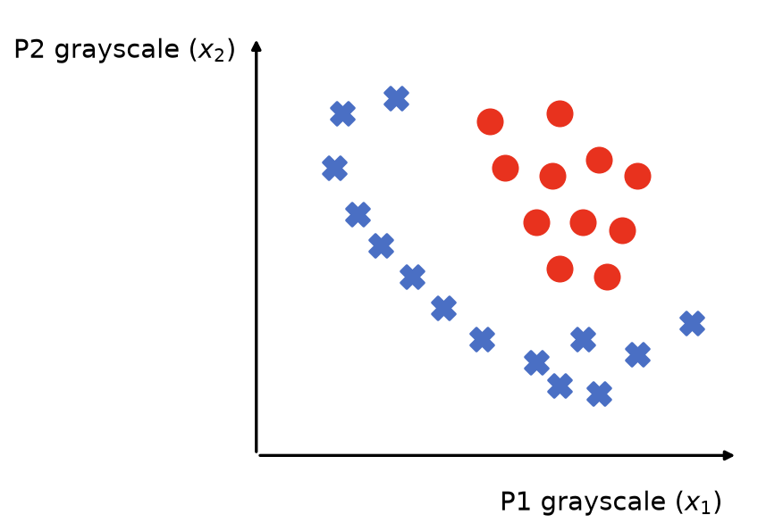
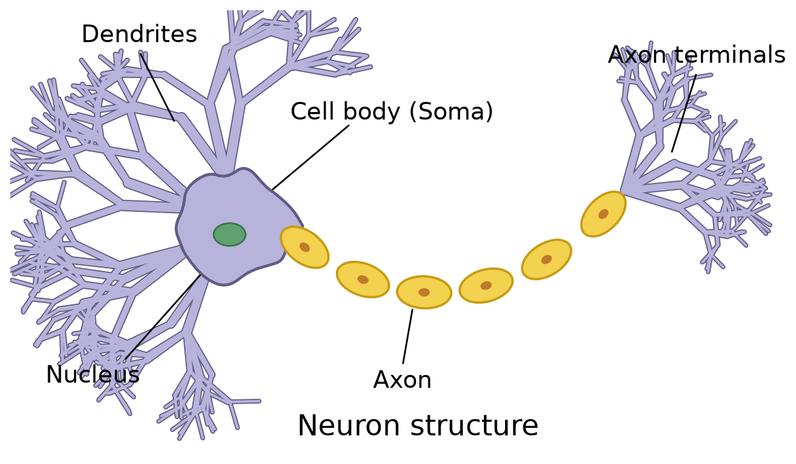
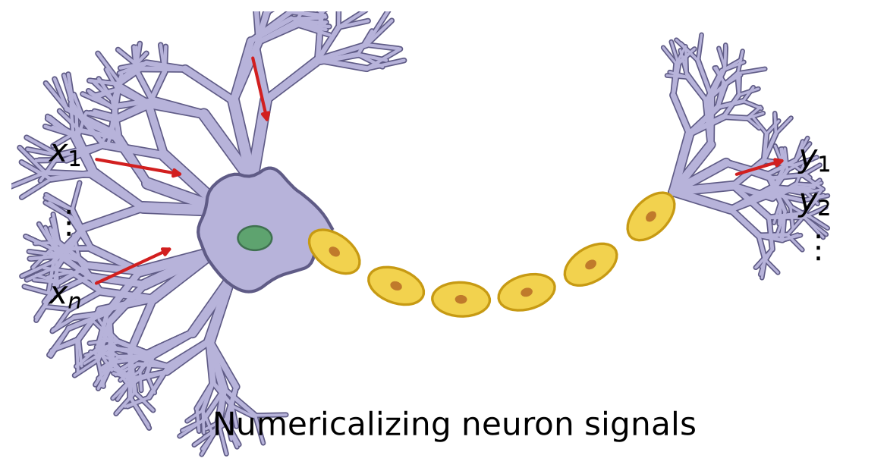
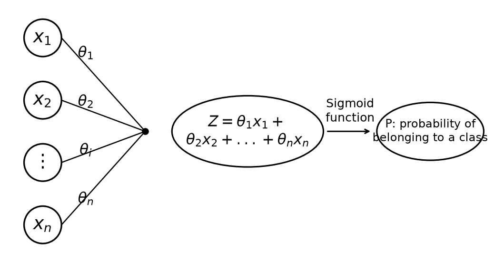

# 1.1. Introduction to Multi-Layer Perceptron (Artificial Neural Network)

## 1.1.1. Why Do We Need a Multi-Layer Perceptron
We have already studied many machine learning algorithms, so why do we still need to learn the multi-layer perceptron?

Let's look at an example:

> Based on the detected data $x_1$, $x_2$ and their labels, determine the category when $x_1 = 0.7$ and $x_2 = 0.6$

In general, we can build a logistic regression model to find the decision boundary. But here the boundary is obviously very complex, and using logistic regression would require generating a polynomial with a huge number of exponential and term combinations.

In the real world, actual data can only be even more complex than this, and there may be more factors as well. If we still use logistic regression at this point, the computation speed will be very slow.

---

Let's take another example:

> Automatically identify whether the animal in a picture is a cat or a dog

Humans can tell very intuitively which one is a cat and which one is a dog, but computers cannot. To a computer, a photo is just a pile of pixels.

Let's simplify the task first. Suppose I take two fixed points, $P_1$ and $P_2$, on each image, obtain the grayscale values at these two points, and then plot the data on a Cartesian coordinate system:

Suppose the red dots represent cats and the blue crosses represent dogs. Then we can let the computer use logistic regression to find the decision boundary that separates cats from dogs. Since we have simplified the task here, the decision boundary does not look very complicated, and logistic regression can handle it.

But in real tasks, we give the computer all pixel grayscale values from a photo. Suppose there is a photo of size 400 x 500, then there will be 200,000 scatter points. At this point, if we use logistic regression, the number of quadratic terms in the model ($x_i \times x_j$) will reach about 20 billion ($\frac{200000 \times 199999}{2}$).

---

Problems that traditional machine learning cannot handle well are exactly what MLP is used for.

## 1.1.2. The Core Idea of a Multi-Layer Perceptron (Artificial Neural Network)
The core idea of a multi-layer perceptron (artificial neural network) is to think like a human. So how do humans think?

This involves a bit of biology:

The most basic structural and functional unit in the nervous system is the neuron.

The two most important parts are the dendrites and the axon terminals:
- Dendrites: receive neurotransmitters released by the axon of the previous neuron, causing the neuron to generate a potential difference and transmit information as an electric current
- Axons: release neurotransmitters to the next neuron to pass along information

A multi-layer perceptron (artificial neural network) mimics this basic structure:

The data are fed into this "neuron" and processed by some formula, producing new data as output.

In fact, this process is very similar to the architecture of logistic regression:

Input data are processed through a formula to produce $P$, and different values of $P$ correspond to different situations.

The human brain is made up of many neurons that form a neural network, and a multi-layer perceptron also relies on many stacked "logistic regression structures" to form an artificial neural network.

## 1.1.3. Mathematical Expression of MLP
Input neurons are the input data, and the value of an output neuron determines the probability of belonging to a certain class. Once we know that each neuron node is a logistic regression model, we can derive the hidden neurons between the input neurons and output neurons. Here we take $a_2^2$ as an example:
$$
a_2^2 = g\left(\theta_{20}^{1} x_0 + \theta_{21}^{1} x_1 + \theta_{22}^{1} x_2 + \theta_{23}^{1} x_3 \right)
$$
  
- $a_2^2$: represents the **activation value of the second neuron in the second layer (the hidden layer)**, that is, the output
- $g(\cdot)$: represents the **activation function**, such as sigmoid, ReLU, or tanh. It is used to introduce nonlinearity so that the model can learn complex relationships
- $\theta_{ij}^{1}$: represents the **weights between the first layer and the second layer**. The superscript 1 here means **this is the weight matrix of the first layer** (usually the weights from the input layer to the hidden layer). For example, $\theta_{21}^{1}$ represents the weight from the first input node in the input layer to the second neuron in the hidden layer.
- $x_0$, $x_1$, $x_2$, $x_3$: represent the input values, where $x_0$ is usually the **bias term**, which is generally set to 1.

Some terminology:
- Sigmoid, ReLU, tanh: formulas used to compute nonlinear transformations. Sigmoid is the same formula used in logistic regression, $P(x) = \frac{1}{1 + e^{-x}}$. We will discuss ReLU and tanh later.
- The bias term is like a "**freely adjustable number**"; it allows a neuron to still produce a nonzero output even when there is no input (or the input is zero), and is used to **adjust the neuron's activation value**

As long as we compute each neural node layer by layer in this way, we can obtain the final $y$.

What we need the computer to do is infer the weights from the classified data.
