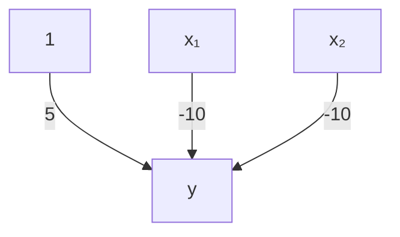
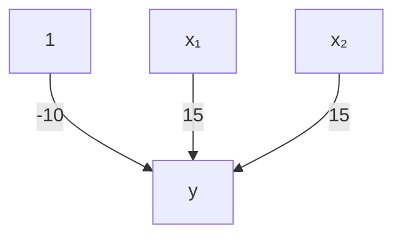
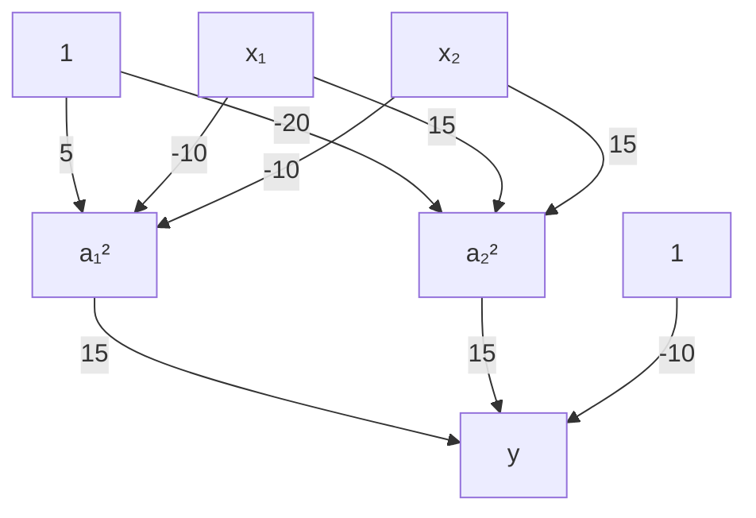
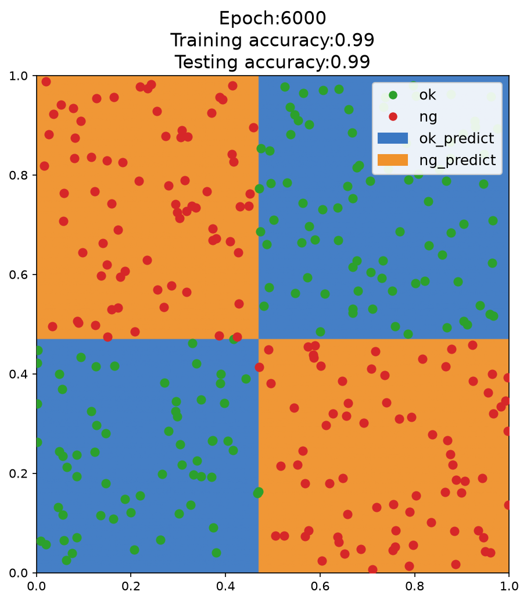
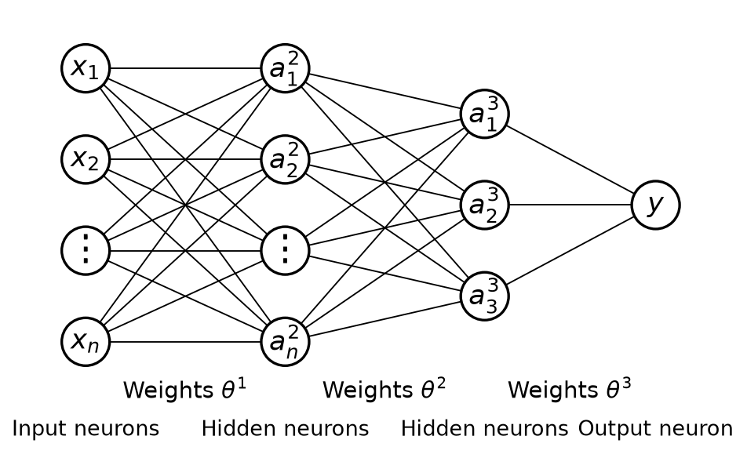
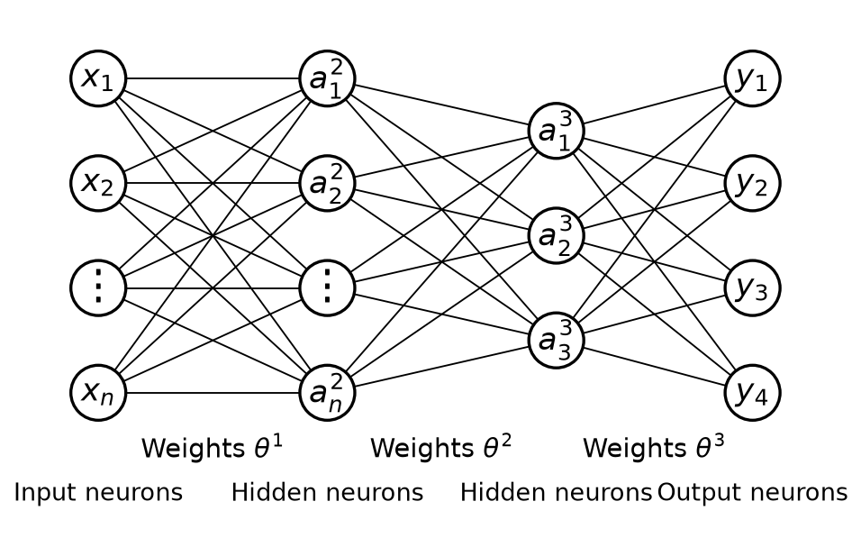

# 1.2. Multi-Layer Perceptron (Artificial Neural Network) Nonlinear Classification Theory

This article continues from the previous article, [1.1. Introduction to Multi-Layer Perceptron (Artificial Neural Network)](<../1.1/1.1. Introduction to Multi-Layer Perceptron (Artificial Neural Network).md>); please read that one first.
## 1.2.1. MLP vs. Logistic Regression
What MLP can do, logistic regression can also do. The drawback of logistic regression is that it must add higher-order terms to complete nonlinear classification, which makes it extremely slow. So our goal is to use MLP to perform classification without adding higher-order terms.

## 1.2.2. An Example
Let's take an example. Suppose our final goal is to classify these points:

We can simplify the model first: red points appear in the lower left and upper right corners, while blue points appear in the upper left and lower right corners:

Suppose red points are valued as 1 and blue points as 0. Then we can get the following truth table:

| X₁  | X₂  | y   |
| --- | --- | --- |
| 0   | 0   | 1   |
| 0   | 1   | 0   |
| 1   | 0   | 0   |
| 1   | 1   | 1   |
- When $x_1$ and $x_2$ are both 0 or both 1, the result is 1
- When $x_1$ and $x_2$ are different, the result is 0

In professional mathematical terms, $y$ is the **XNOR gate** of $x_1$ and $x_2$ ($y: x_1 \text{ XNOR } x_2$).
## 1.2.3. Logic Gates
### AND Gate
The **XNOR gate** mentioned above is one kind of logic gate. Let's first talk about the most basic logic gate, the **AND gate** ($AND$): only when $x_1$ and $x_2$ are both true (1) does the result become true (1); in all other cases it is false (0).

Suppose we have the following input factors:
$x_0 = 1$, $x_1$, and $x_2$
- $x_0$ is usually the **bias term**, and is generally set to 1. The bias term is like a "**freely adjustable number**"; it allows a neuron to still produce a nonzero output even when there is no input (or the input is zero), and is used to **adjust the neuron's activation value**

Let the weights of each input be $\theta_{10}^1$, $\theta_{11}^1$, and $\theta_{12}^1$. Multiply each input by its weight, add them up, and then apply the logistic function to obtain the neuron output:
$$
y = h(\theta, x) = g\left(\theta_{10}^{1} + \theta_{11}^{1} x_1 + \theta_{12}^{1} x_2\right)
$$
- $\theta_{ij}^{1}$: represents the **weights between the first layer and the second layer**. The superscript 1 here means **this is the weight matrix of the first layer** (usually the weights from the input layer to the hidden layer). For example, $\theta_{11}^{1}$ represents the weight from the first input node in the input layer to the first neuron in the hidden layer.

Where:
$$
g(x) = \frac{1}{1 + e^{-x}}
$$

If we set the weights to $\theta_{10}^1 = -20$, $\theta_{11}^1 = 15$, and $\theta_{12}^1 = 15$, this neuron can implement the **AND gate**. We can first substitute these parameters into the formula:
$$
h(\theta, x) = g\left(-20 + 15x_1 + 15x_2\right)
$$

Let's compute the value for each case:

| x₁  | x₂  | $h(\theta, x)$ | y   |
| --- | --- | -------------- | --- |
| 0   | 0   | $g(-20)$       | 0   |
| 0   | 1   | $g(-5)$        | 0   |
| 1   | 0   | $g(-5)$        | 0   |
| 1   | 1   | $g(10)$        | 1   |

Only when both $x_1$ and $x_2$ are 1 is the $y$ value 1. This shows that the neuron implements the **AND gate**.

### Neither $x_1$ Nor $x_2$
Next, let's look at a more complex logic gate: how do we express "neither $x_1$ nor $x_2$"? In this phrase, "neither" means NOT, and "nor" means AND.

So the logic gate expression should be: $y$: $NOT(x_1)$ $AND$ $NOT(x_2)$

By changing the weights, we can modify the neuron above so that it outputs the logic of neither $x_1$ nor $x_2$:
$$
h(\theta, x) = g\left(5 - 10x_1 - 10x_2\right)
$$

Let's plug in the data:

| x₁  | x₂  | $h(θ, x)$ | y   |
| --- | --- | --------- | --- |
| 0   | 0   | $g(5)$    | 1   |
| 0   | 1   | $g(-5)$   | 0   |
| 1   | 0   | $g(-5)$   | 0   |
| 1   | 1   | $g(-15)$  | 0   |

### OR Gate
If we want to implement an OR gate ($y:$ $x_1$ $OR$ $x_2$): if either $x_1$ or $x_2$ is 1, the final result is 1. We can set the weights like this:
$$
h(\theta, x) = g\left(-10 + 15x_1 + 15x_2\right)
$$

Let's plug in the data:

| x₁  | x₂  | $h(θ, x)$ | y   |
| --- | --- | --------- | --- |
| 0   | 0   | $g(-10)$  | 0   |
| 0   | 1   | $g(5)$    | 1   |
| 1   | 0   | $g(5)$    | 1   |
| 1   | 1   | $g(20)$   | 1   |

## 1.2.4. Logic Gates and MLP
$y:$ $x_1$ $AND$ $x_2$

$y$: $NOT(x_1)$ $AND$ $NOT(x_2)$

$y:$ $x_1$ $OR$ $x_2$

By combining these logic gates in different arrangements, we can build a more complex MLP model and thus realize the original **XNOR gate** ($y: x_1 \text{ XNOR } x_2$) logic.

How do we do that? The logic is as follows:

This may look a little confusing, so let me explain step by step:
- The value of $a_1^2$ is the result of the "neither $x_1$ nor $x_2$" logic for $x_1$ and $x_2$
- The value of $a_2^2$ is the result of the AND gate for $x_1$ and $x_2$
- The value of $y$ is the OR gate result of $a_1^2$ and $a_2^2$

Let's plug in the data and see whether this setup can achieve the effect of the **XNOR gate**:

| x₁  | x₂  | a₁² | a₂² | $h(θ, x)$ | y   |
| --- | --- | --- | --- | --------- | --- |
| 0   | 0   | 1   | 0   | $g(5)$    | 1   |
| 0   | 1   | 0   | 0   | $g(-10)$  | 0   |
| 1   | 0   | 0   | 0   | $g(-10)$  | 0   |
| 1   | 1   | 0   | 1   | $g(5)$    | 1   |

## 1.2.5. Solving the Problem
What we just solved was the classification problem of the simplified model:

So how does the machine iterate toward something like this XNOR-gate effect? We only need to let the model keep iterating to obtain the classification of the final example:

How exactly does the iteration work?
**(1) Randomly initialize the weights**
- The initial weights of the MLP (multi-layer perceptron) are **randomly initialized**, which means the decision boundary at the beginning is **random** and may not have any practical meaning.

**(2) Forward propagation to compute outputs**
- Compute the output after the input $x_1$ and $x_2$ pass through the hidden layer and activation function.
- Compute the final predicted value $y$ of the MLP.
- Compare it with the true label $y_{\text{true}}$ and compute the loss function, such as cross-entropy loss or mean squared error.

**(3) Error computation and backpropagation**
- Use **Backpropagation** to calculate each weight's contribution to the error.
- Use **Gradient Descent** or Adam to update the parameters so that the model's predictions become closer to the true labels.

**(4) After several rounds of iteration**:
  - The MLP gradually learns which regions should output 1 and which regions should output 0.
  - The **hidden layer neurons** learn basic features, such as certain regions corresponding to the **AND gate** and others corresponding to the **OR gate**, eventually combining into an XNOR model.
  - During training, the **decision boundary gradually approaches the real classification boundary**, eventually forming a **nonlinear separating surface** similar to the one shown by the boundary between the blue and orange regions in the figure.

## 1.2.6. MLP for Multi-Classification
In real life, data are not limited to just two cases; there can be many. In that case, we need MLP to perform multi-class classification.

Let's recall the basic framework of MLP:

We can implement multi-class classification by outputting several neurons. Suppose there are 4 classes, then we set up 4 output neurons: $y_1$, $y_2$, $y_3$, and $y_4$. After inputting the data, we obtain the outputs of these 4 neurons, which are the probabilities that the data belongs to each class. We simply choose the one with the highest probability as the prediction result, as shown below:

