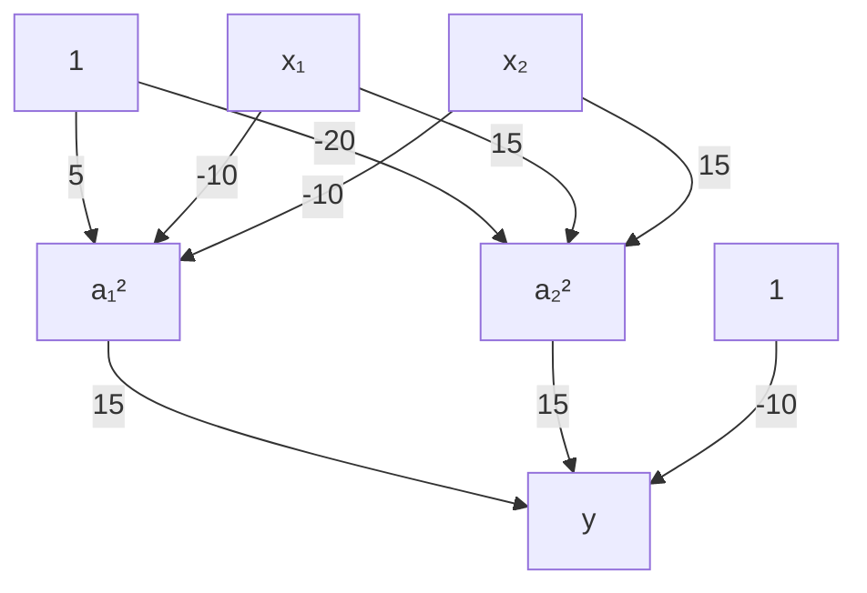

# 1.3. Using Keras to Implement Multi-Layer Perceptron (Artificial Neural Network) Hands-On (Basics)

This article continues from the previous article, [1.2. Multi-Layer Perceptron (Artificial Neural Network) Nonlinear Classification Theory](<../1.2/1.2. Multi-Layer Perceptron (Artificial Neural Network) Nonlinear Classification Theory.md>); please read that one first.

## 1.3.1. Keras
Keras is an application programming interface written in Python for neural network development. By using this API, you can develop neural networks, convolutional neural networks, recurrent neural networks, and other common deep learning algorithms.

Features:
- It integrates many mature deep learning algorithms, is easy to install and use, comes with abundant examples, and has very detailed tutorials and documentation
- It can run with TensorFlow or Theano as its backend

I have attached the [official website](https://keras.io/) here.

## 1.3.2. Relationship Between Keras and TensorFlow
TensorFlow is an open-source software library that uses a data-flow graph and is **used for numerical computation**. It can automatically compute derivatives related to a model, which makes it very suitable for solving neural network models.

Keras can be seen as an interface encapsulated on top of TensorFlow (Keras as the front end, TensorFlow as the back end). Keras provides users with an easy-to-interact-with shell that makes rapid deep learning development convenient.

## 1.3.3. Install Keras and TensorFlow
Enter the following command in the terminal to download and install them:
```bash
pip install keras tensorflow
```

## 1.3.4. Preparation
This article uses my `csv` file. I uploaded it to [GitHub](https://github.com/SomeB1oody/learning_examples/blob/main/deep_learning_example/1.3/scatter_data.csv), and you can click the link to view and download it.

It has 3 columns of information: one column is `x1`, one column is `x2`, and these two columns represent the two input variables. The other column is `label`, and the values in this column are either 0 or 1.

After downloading it, just move it into your Python project folder.

## 1.3.5. Write the Code
### Step 1: Load the Data
First, use the `pandas` library to read the data:
```python
# Read the data  
import pandas as pd  
data = pd.read_csv('scatter_data.csv')  
```

Visualize it with `matplotlib`:
```python
# Visualize the raw data  
# Draw the scatter plot  
import matplotlib.pyplot as plt  
  
scatter = plt.scatter(  
    data['x1'],  
    data['x2'],  
    c = ['blue' if label == 0 else 'red' for label in data['label']],  
)  
  
plt.show()
```

Image output:


### Step 2: Assign Values to `x` and `y`
- The value of `x` corresponds to the two input values `x1` and `x2`
- The value of `y` corresponds to the label `label`

```python
# Assign values to x and y  
x = data.drop(['label'], axis=1)  
y = data.loc[:,'label']
```

We also need to split the data into training and test sets for later model evaluation:
```python
# Split into training and test sets  
from sklearn.model_selection import train_test_split  
x_train, x_test, y_train, y_test = train_test_split(x, y, test_size=0.3, random_state=10)
```

### Step 3: Create the Model
We need to create an MLP with three layers to solve the problem, and each neuron uses the logistic function. Its rough structure should look like this flowchart:


```python
# Build a Sequential model  
from keras.models import Sequential  
model = Sequential()  
  
# Stack layers with add  
from keras.layers import Dense  
model.add(Dense(units=20, activation='sigmoid', input_dim=2)) # From the first layer (input layer) to the second layer (hidden layer)  
model.add(Dense(units=1, activation='sigmoid')) # From the second layer (hidden layer) to the third layer (output layer)  
  
# View the model structure  
model.summary()  
  
# Configure model-solving parameters with .compile()  
model.compile(loss='binary_crossentropy', optimizer='adam', metrics=['accuracy'])
```
- `Sequential` is a basic model type in Keras used to stack network layers one after another, with each layer connected in creation order. This approach is ideal for building neural networks that follow a single path from input to output, such as classic feedforward neural networks

- The first `add` adds a `Dense` layer (a hidden layer):
  - Fully connected layer, where each neuron is connected to every neuron in the previous layer
  - `units=20`: indicates that the hidden layer contains 20 neurons
  - `activation='sigmoid'`: uses the logistic function as the activation function, which maps input values into the range (0, 1) and is suitable for binary classification or probability outputs
  - `input_dim=2`: indicates that the input feature dimension is 2 (`x1` and `x2`), which is the input shape of the first layer

- The second `add` adds the output layer:
  - `units=1`: indicates that this layer has only one neuron, i.e. the output dimension is 1
  - `activation='sigmoid'`: in the output layer, sigmoid is commonly used as the activation function for binary classification problems, producing values between 0 and 1 that represent the probability of belonging to a certain class

- `model.summary()`: prints detailed structural information about the neural network model, including each layer's name, output shape, and parameter count. This is an important method for debugging and understanding the model, and it helps confirm that the model you built matches your intended design

- `.compile()` defines the training configuration of the model, including the loss function, optimizer, and evaluation metrics:
  - `loss='binary_crossentropy'`: the loss function. Choose the appropriate loss based on the task. `binary_crossentropy` is generally used for binary classification
  - `optimizer='adam'`: the optimizer, here Adam (Adaptive Moment Estimation)
  - `metrics=['accuracy']`: the evaluation metric; here accuracy is selected as the evaluation criterion

Output:
```
Model: "sequential"
┏━━━━━━━━━━━━━━━━━━━━━━━━━━━━━━━━━┳━━━━━━━━━━━━━━━━━━━━━━━━┳━━━━━━━━━━━━━━━┓
┃ Layer (type)                    ┃ Output Shape           ┃       Param # ┃
┡━━━━━━━━━━━━━━━━━━━━━━━━━━━━━━━━━╇━━━━━━━━━━━━━━━━━━━━━━━━╇━━━━━━━━━━━━━━━┩
│ dense (Dense)                   │ (None, 20)             │            60 │
├─────────────────────────────────┼────────────────────────┼───────────────┤
│ dense_1 (Dense)                 │ (None, 1)              │            21 │
└─────────────────────────────────┴────────────────────────┴───────────────┘
 Total params: 81 (324.00 B)
 Trainable params: 81 (324.00 B)
 Non-trainable params: 0 (0.00 B)
```

### Step 4: Train the Model
We just need to feed the data into the model and let it iterate:
```python
model.fit(x_train, y_train, epochs=3000)
```
- The `epochs` parameter controls the number of iterations

### Step 5: Predict the Data
We use the `x` values in the test set to predict the `y` values and compare them with the actual `y` values to generate accuracy:
```python
# Predicted values  
y_predict = model.predict(x_test)  
  
# Convert probability values into discrete class labels  
y_predict_classes = (y_predict > 0.5).astype(int)  
  
# Calculate accuracy  
from sklearn.metrics import accuracy_score  
  
print(accuracy_score(y_test, y_predict_classes))
```

Output:
```
0.9977413890457368
```

If we keep iterating, the accuracy will be even higher, but it may cause overfitting, which would not be worth it.
