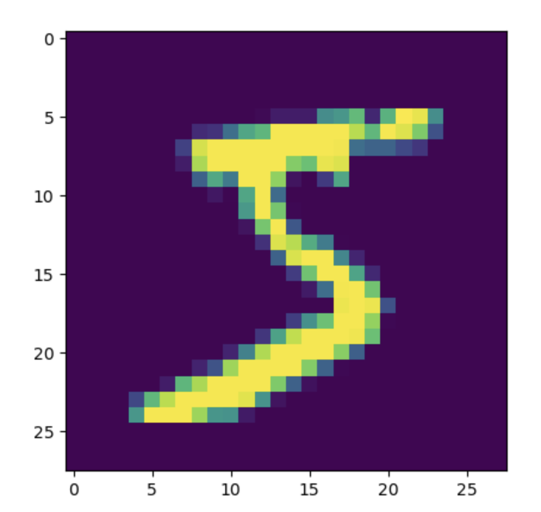

# 1.4. Multi-Layer Perceptron (Artificial Neural Network) Handwritten Digit Recognition (Image Multi-Classification)

This article continues from the previous article, [1.3. Using Keras to Implement Multi-Layer Perceptron (Artificial Neural Network) Hands-On (Basics)](<../1.3/1.3. Using Keras to Implement Multi-Layer Perceptron (Artificial Neural Network) Hands-On (Basics).md>); please read that one first.

## 1.4.1. MNIST Dataset
In this article, we will use the MNIST dataset to build an MLP model and recognize handwritten digits from 0 to 9.

The MNIST (Modified National Institute of Standards and Technology) dataset is a handwritten digit recognition dataset used to train and test machine learning models. It consists of **70,000** grayscale images, of which:
- **Training Set**: 60,000 images
- **Test Set**: 10,000 images

Each image is a **28×28** grayscale image representing a handwritten digit between 0 and 9. The labels are integers from 0 to 9, indicating the digit category shown in the image.

We use it because:
- **Standardized**: all images have the same size (28×28 pixels)
- **Easy to use**: suitable as an introductory dataset for deep learning
- **Widely used**: used to test the performance of various machine learning and deep learning models, such as CNNs (convolutional neural networks), SVMs (support vector machines), and more

## 1.4.2. Preparation
This article uses `keras`, `tensorflow`, and `matplotlib`. If you do not have them installed, please install them.

Enter the following command in the terminal to download and install them:
```bash
pip install keras tensorflow matplotlib
```

## 1.4.3. Write the Code
### Step 1: Import the MNIST Dataset
`Keras` already includes the MNIST dataset, so we can import it directly:
```python
from keras.datasets import mnist  
(x_train, y_train),(x_test, y_test) = mnist.load_data()
```

The first time you use the dataset, the program will download the resources from the official website, so you will need to wait a moment. Let's take a look at some information about the data:
```python
print(type(x_train), x_train.shape)
```

```
<class 'numpy.ndarray'> (60000, 28, 28)
```
- Its type is a `numpy` array
- It contains 60,000 samples, and each sample is 28 by 28 pixels

We can use `matplotlib` to see what the data looks like:
```python
# Visualize the input data  
from matplotlib import pyplot as plt  
plt.imshow(x_train[0])  
plt.show()
```

Output image:



### Step 2: Array Conversion
We need to convert each image from a 28-by-28 two-dimensional array into a one-dimensional array with 784 elements so that the MLP can receive it:
```python
# Convert the data  
feature_size = x_train.shape[1] * x_train.shape[2]  
x_train = x_train.reshape(x_train.shape[0], feature_size)  
x_test = x_test.reshape(x_test.shape[0], feature_size)
```
- The original shape is `(number of samples, height, width)`, which represents the data for each image. After conversion, the shape becomes `(number of samples, feature size)`, flattening all pixels into a one-dimensional feature vector so that each image can be processed as a sample by the model
- `feature_size` corresponds to the feature size, that is, the number of pixels in a single image. You can get it with `x_train.shape[1] * x_train.shape[2]`
- `reshape` is a method in NumPy used to adjust the shape of an array. It is often used to reshape matrices or tensors without changing the data itself. This method does not modify the original array; instead, it returns a new array that shares memory with the original data

We can print the structure of the data at this point:
```python
print(x_train.shape)
```

Output:
```
(60000, 784)
```

### Step 3: Data Normalization
The images in the MNIST dataset are 8-bit grayscale images, and the pixel values range from 0 to 255. Nonlinear activation functions used in MLP models, such as `sigmoid`, `tanh`, and `ReLU`, are sensitive to value ranges. So we need to normalize the data and shrink the range.

In general, dividing the grayscale pixel values by 255 is enough. This keeps the values between 0 and 1, which is more suitable for an MLP model:
```python
# Normalize the data  
x_train = x_train.astype('float32')  
x_test = x_test.astype('float32')  
x_train /= 255  
x_test /= 255
```
- `astype('float32')`: after loading, the pixel values in the MNIST dataset are integers (`0` to `255`). `astype('float32')` converts them to floating-point values so that more precise mathematical operations, such as normalization and gradient updates, can be performed
- `x_train /= 255` and `x_test /= 255`: divide the pixel values by 255 so that the range is compressed from `[0, 255]` to `[0, 1]`

### Step 4: Convert the Label Format
The model output labels will use one-hot encoding: each class is assigned one position, with the specific class position set to 1 and all others set to 0. Suppose there are 3 classes: `A`, `B`, and `C`, then:
- Class `A` is encoded as `[1, 0, 0]`
- Class `B` is encoded as `[0, 1, 0]`
- Class `C` is encoded as `[0, 0, 1]`

The original label format is integer labels: for example, if the image is a handwritten 5, the corresponding label value is 5.

Because these two storage formats are different, it becomes troublesome to compare labels and evaluate the model. We need to convert the original integer labels into one-hot encoding.

Suppose our label is 5. We need to store "5" like this:
```
[0, 0, 0, 0, 0, 1, 0, 0, 0, 0]
```
To represent 5, write 1 in the 6th position (the first position is 0, so the placement of each digit must be shifted by 1), and set the rest to 0.

`keras` provides the `to_categorical` function for converting label formats:
```python
# Convert the label format  
from keras.utils import to_categorical  
y_train = to_categorical(y_train)  
y_test = to_categorical(y_test)
```

### Step 5: Build the Model
After completing all the data preprocessing work mentioned above, we can build the model! Our input has 784 features (corresponding to the number of pixels), the second layer will be reduced by half to 392 neurons, the third layer will still keep 392 neurons, and the fourth layer, which is the output layer, needs 10 output neurons corresponding to 0 through 9:
```python
# Build the model  
from keras.models import Sequential  
from keras.layers import Dense  
  
model = Sequential()  
model.add(Dense(units=392, activation='sigmoid', input_dim=feature_size))  
model.add(Dense(units=392, activation='sigmoid'))  
model.add(Dense(units=10, activation='softmax'))
```
- **`units=392`**: indicates that this layer has 392 neurons (hidden nodes)

- **`input_dim=feature_size`**: the **input dimension**, which indicates how many features the layer receives. This corresponds to the previous input-layer shape `(number of samples, feature_size)`, where `feature_size = 784` (after each MNIST image is converted into a feature vector, it has 784 pixels). Starting from the second layer, there is no need to explicitly declare `input_dim`, because the input shape is automatically inferred from the output of the previous layer (the first hidden layer)

- **Softmax activation function** maps the values of the output neurons (logits) into a probability distribution, making it suitable for multi-class classification problems

Let's use the `summary` method to display the structure:
```python
model.summary()
```

Output:
```
Model: "sequential"
┏━━━━━━━━━━━━━━━━━━━━━━━━━━━━━━━━━┳━━━━━━━━━━━━━━━━━━━━━━━━┳━━━━━━━━━━━━━━━┓
┃ Layer (type)                    ┃ Output Shape           ┃       Param # ┃
┡━━━━━━━━━━━━━━━━━━━━━━━━━━━━━━━━━╇━━━━━━━━━━━━━━━━━━━━━━━━╇━━━━━━━━━━━━━━━┩
│ dense (Dense)                   │ (None, 392)            │       307,720 │
├─────────────────────────────────┼────────────────────────┼───────────────┤
│ dense_1 (Dense)                 │ (None, 392)            │       154,056 │
├─────────────────────────────────┼────────────────────────┼───────────────┤
│ dense_2 (Dense)                 │ (None, 10)             │         3,930 │
└─────────────────────────────────┴────────────────────────┴───────────────┘
 Total params: 465,706 (1.78 MB)
 Trainable params: 465,706 (1.78 MB)
 Non-trainable params: 0 (0.00 B)
```

### Step 6: Configure the Model
When configuring the model, we can choose whether it is a binary classification or multi-class classification model, and which optimization algorithm to use:
```python
# Configure the model  
model.compile(loss='categorical_crossentropy', optimizer='adam', metrics=['accuracy'])
```
- `compile` is a Keras model method used to configure the learning process before training. Its main parameters are:
  - **Loss function (`loss`)**: defines how errors are computed during training.
  - **Optimizer (`optimizer`)**: determines how the model's parameters, such as weights and biases, are updated to minimize the loss function.
  - **Evaluation metrics (`metrics`)**: determine the metrics used to evaluate model performance. These metrics do not affect training; they are only used to measure results.

- **`loss='categorical_crossentropy'`**: `categorical_crossentropy` (categorical cross-entropy) is a commonly used loss function for multi-class tasks
- **`optimizer='adam'`**: **`adam`** (Adaptive Moment Estimation) is an adaptive learning-rate optimization algorithm and one of the most commonly used optimizers in deep learning
- **`metrics=['accuracy']`**: specifies accuracy as the metric used to measure performance during training and evaluation

### Step 7: Train the Model
We just need to feed the training data into the model:
```python
# Train the model  
model.fit(x_train, y_train, epochs=10)
```
- The `epochs` parameter controls the number of iterations

Compared with the [previous article](<../1.3/1.3. Using Keras to Implement Multi-Layer Perceptron (Artificial Neural Network) Hands-On (Basics).md>), this time we chose a much smaller number of iterations (the previous one was 3,000 iterations, while this one only has 10). This is because our image data are very large (60,000 samples), so we can get good results without many iterations. However, each iteration will take longer.

### Step 8: Evaluate the Model
We use accuracy to evaluate the model.

Since Step 4 already converted the labels to one-hot encoding, we can evaluate by using `argmax` to recover class indices from both the predicted probabilities and the true labels, then comparing them:
```python
# Training set accuracy  
import numpy as np  
y_train_predict = model.predict(x_train)  
y_train_pred_classes = np.argmax(y_train_predict, axis=1)  
y_train_true_classes = np.argmax(y_train, axis=1)  
train_accuracy = np.mean(y_train_pred_classes == y_train_true_classes)  
print("Training set accuracy:", train_accuracy)  
  
# Test set accuracy  
y_test_predict = model.predict(x_test)  
y_test_pred_classes = np.argmax(y_test_predict, axis=1)  
y_test_true_classes = np.argmax(y_test, axis=1)  
test_accuracy = np.mean(y_test_pred_classes == y_test_true_classes)  
print("Test set accuracy:", test_accuracy)
```
- `np.argmax(..., axis=1)`: for each row, take the class index with the highest probability. For example, a prediction `[0.1, 0.8, 0.1, ...]` becomes class `1`
- Compare predicted classes with true classes sample by sample, then use `np.mean` to get the proportion that match, which is the accuracy


Output:
```
Training set accuracy: 0.9979166666666667
Test set accuracy: 0.9808
```
