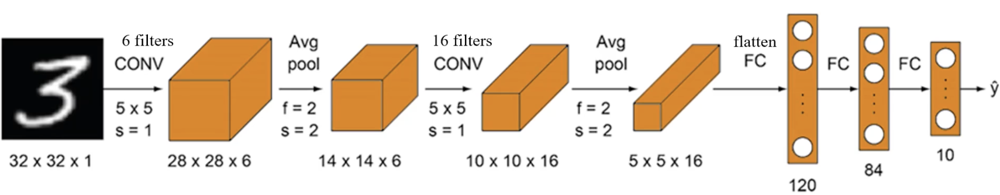
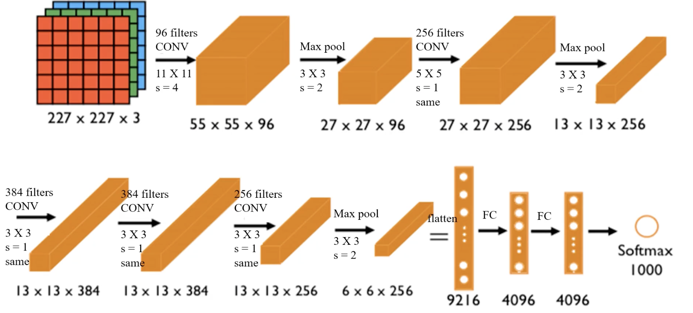
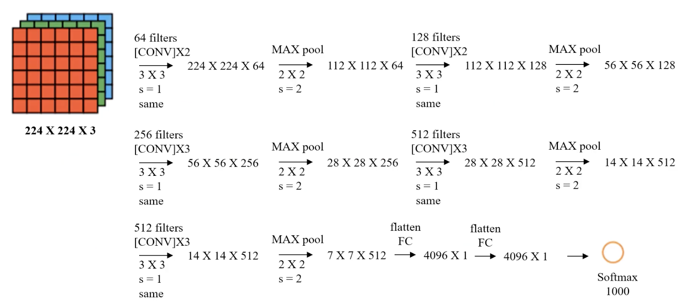

# 2.2. Convolutional Neural Network (CNN) Model Theory (Advanced) - Image Padding, LeNet, and AlexNet

This article follows directly from the previous article, [2.1. Convolutional Neural Network (CNN) Model Theory (Basic) - Convolution, Pooling, and ReLU Function](<../2.1/2.1. Convolutional Neural Network (CNN) Model Theory (Basic) - Convolution, Pooling, and ReLU Function.md>), so if you have not read it yet, it is recommended to read that first.

## 2.2.1. Image Padding
Convolution introduces two problems:
- The image gets compressed, causing information loss: the convolved image is smaller than the original image
- Edge information is used less and is easier to ignore: center pixels are repeatedly computed during convolution, while edge pixels are computed only once

To address these problems, we use image padding: by adding pixels around the edges of the image, we can keep the image the same size after convolution. The amount of padding is determined by the **filter size** and the **stride**, so that the convolved image has the same size as the original image.
- The added pixels are 0, so they do not affect the original image information.

For example, suppose I have a 5×5 image, the filter size is 3×3, and the stride is $(1,1)$. How many pixels should I pad?

The output size is calculated using the following formula:
$$
O = \frac{(I - K + 2P)}{S} + 1
$$

Where:
- I is the input size (5×5)
- K is the filter size (3×3)
- P is the padding amount **on each side** (top/bottom or left/right); the formula uses $2P$ because both sides are padded
- S is the stride (1×1)

If we want the output size to still be $5 \times 5$, we set $O = 5$ and $K = 3$, then solve the equation:
$$
5 = \frac{(5 - 3 + 2P)}{1} + 1
$$
We get $P = 1$. That is, we pad **1 pixel on each side**, so the total padding along one dimension is $2P = 2$.

If the required total padding along one dimension is odd, it cannot be split evenly across the two sides, so we need to decide which side gets one extra pixel. A common practice is to pad one extra pixel on the right/bottom, because some deep learning frameworks, such as TensorFlow, default to a “more padding on the bottom/right” strategy.

## 2.2.2. Classic CNN Models
In the previous article ([2.1. Convolutional Neural Network (CNN) Model Theory (Basic) - Convolution, Pooling, and ReLU Function](<../2.1/2.1. Convolutional Neural Network (CNN) Model Theory (Basic) - Convolution, Pooling, and ReLU Function.md>)), we mentioned that CNN is a model formed by connecting the following operations:
- Convolution
- Pooling
- MLP

So what is the exact order? Are there steps that need to be repeated? To answer these questions, let us look at what CNN models created by earlier researchers look like.

### LeNet-5
LeNet-5 is a classic convolutional neural network (CNN) architecture proposed by Yann LeCun and others in 1998, mainly for handwritten digit recognition, such as on the MNIST dataset.

Input Layer
- **Size**: $32 \times 32$ grayscale image (the original MNIST size is $28 \times 28$, which is padded to $32 \times 32$)
- **Channels**: 1 (grayscale image)

First layer: Convolutional Layer C1
- **Input size**: $32 \times 32 \times 1$
- **Filters (kernel)**: 6 $5 \times 5$ convolution kernels (stride=1, valid padding)
- **Computation formula**:

$O = \frac{(I - K + 2P)}{S} + 1 = \frac{(32 - 5 + 0)}{1} + 1 = 28$

- **Output size**: $28 \times 28 \times 6$ (6 feature maps)
- **Activation function**: Sigmoid (modern CNNs may use ReLU)

Second layer: Pooling Layer S2 (Subsampling / Pooling Layer)
- **Input size**: $28 \times 28 \times 6$
- **Operation**: $2 \times 2$ average pooling (stride=2)
- **Computation formula**:
$O = \frac{(I - K)}{S} + 1 = \frac{(28 - 2)}{2} + 1 = 14$

- **Output size**: $14 \times 14 \times 6$ (reduced size after pooling)
- **Activation function**: Sigmoid

Third layer: Convolutional Layer C3
- **Input size**: $14 \times 14 \times 6$
- **Filters**: 16 $5 \times 5$ filters
- **Computation formula**:
$O = \frac{(I - K + 2P)}{S} + 1 = \frac{(14 - 5 + 0)}{1} + 1 = 10$

- **Output size**: $10 \times 10 \times 16$
- **Activation function**: Sigmoid
- **Connection pattern**: not fully connected; only some feature maps are connected, which reduces parameters

Fourth layer: Pooling Layer S4 (Subsampling / Pooling Layer)
- **Input size**: $10 \times 10 \times 16$
- **Operation**: $2 \times 2$ average pooling (stride=2)
- **Computation formula**:
$O = \frac{(10 - 2)}{2} + 1 = 5$

- **Output size**: $5 \times 5 \times 16$
- **Activation function**: Sigmoid

Fifth layer: Fully Connected Layer C5
- **Input size**: $5 \times 5 \times 16 = 400$ neurons
- **Output neurons**: 120 (fully connected)
- **Activation function**: Sigmoid

Sixth layer: Fully Connected Layer F6
- **Input neurons**: 120
- **Output neurons**: 84
- **Activation function**: Sigmoid

Output Layer
- **Input neurons**: 84
- **Output neurons**: 10 (corresponding to digits 0-9)
- **Activation function**: Softmax (for classification tasks)

Let us summarize it in a table:

| Layer | Description | Input Size | Output Size | Kernel Size | Activation |
| ----- | ----------- | ---------- | ----------- | ----------- | ---------- |
| Input Layer | Grayscale image | $32 \times 32 \times 1$ | $32 \times 32 \times 1$ | - | - |
| C1 Convolution | 6 $5 \times 5$ filters | $32 \times 32 \times 1$ | $28 \times 28 \times 6$ | $5 \times 5$ | Sigmoid |
| S2 Pooling | Average pooling $2 \times 2$ | $28 \times 28 \times 6$ | $14 \times 14 \times 6$ | $2 \times 2$ | Sigmoid |
| C3 Convolution | 16 $5 \times 5$ filters | $14 \times 14 \times 6$ | $10 \times 10 \times 16$ | $5 \times 5$ | Sigmoid |
| S4 Pooling | Average pooling $2 \times 2$ | $10 \times 10 \times 16$ | $5 \times 5 \times 16$ | $2 \times 2$ | Sigmoid |
| C5 Fully Connected | 400 input neurons | $5 \times 5 \times 16 = 400$ | 120 | - | Sigmoid |
| F6 Fully Connected | 120 input neurons | 120 | 84 | - | Sigmoid |
| Output Layer | Softmax classification | 84 | 10 | - | Softmax |

Input image: 32×32 grayscale image, 1 channel
Trainable parameters: about 60,000
Features:
- As the network gets deeper, the image height and width shrink while the number of channels increases
- Convolution and pooling are used in pairs, block by block

---

### AlexNet
As science and technology advanced, computer computing power and mathematical theory also developed. LeNet has already been superseded, and its successor is AlexNet.

AlexNet was proposed by **Alex Krizhevsky** and others in 2012 and achieved great success in the ImageNet competition (ILSVRC-2012). It is considered **a milestone in modern deep learning**. Compared with LeNet-5, it is **deeper and wider**, and introduces new techniques such as the **ReLU activation function, overlapping pooling, Dropout, and data augmentation**, which greatly improved CNN performance on large-scale datasets.

Input Layer
- **Size**: $227 \times 227 \times 3$ (RGB image)
- **Preprocessing**: subtract mean for normalization

First layer: Convolutional Layer Conv1
- **Input size**: $227 \times 227 \times 3$
- **Filters (kernel)**: 96 $11 \times 11$ filters, stride S = 4
- **Padding**: 0 (valid)
- **Computation formula**:
$O = \frac{(I - K + 2P)}{S} + 1 = \frac{(227 - 11 + 0)}{4} + 1 = 55$

- **Output size**: $55 \times 55 \times 96$
- **Activation function**: ReLU

- **Characteristics**:
  - Large $11 \times 11$ convolution kernels with stride 4 accelerate feature extraction
  - **ReLU replaces Sigmoid**, speeding up convergence
  - **Local Response Normalization (LRN)**: enhances contrast

Second layer: Max Pooling Layer Pool1
- **Input size**: $55 \times 55 \times 96$
- **Pooling method**: $3 \times 3$ max pooling, stride 2
- **Computation formula**:
$O = \frac{(55 - 3)}{2} + 1 = 27$

- **Output size**: $27 \times 27 \times 96$

Third layer: Convolutional Layer Conv2
- **Input size**: $27 \times 27 \times 96$
- **Filters**: 256 $5 \times 5$ filters, stride 1, padding 2
- **Computation formula**:
$O = \frac{(27 - 5 + 2 \times 2)}{1} + 1 = 27$

- **Output size**: $27 \times 27 \times 256$
- **Activation function**: ReLU
- **LRN normalization**

- **Characteristics**:
  - Smaller $5 \times 5$ convolution kernels capture more fine-grained features
  - Normalization improves generalization

Fourth layer: Max Pooling Layer Pool2
- **Input size**: $27 \times 27 \times 256$
- **Pooling method**: $3 \times 3$ max pooling, stride 2
- **Computation formula**:
$O = \frac{(27 - 3)}{2} + 1 = 13$

- **Output size**: $13 \times 13 \times 256$

Fifth layer: Convolutional Layer Conv3
- **Input size**: $13 \times 13 \times 256$
- **Filters**: 384 $3 \times 3$ filters, stride 1, padding 1
- **Computation formula**:
$O = \frac{(13 - 3 + 2 \times 1)}{1} + 1 = 13$

- **Output size**: $13 \times 13 \times 384$
- **Activation function**: ReLU

- **Characteristics**: further extracts higher-level features

Sixth layer: Convolutional Layer Conv4
- **Input size**: $13 \times 13 \times 384$
- **Filters**: 384 $3 \times 3$ filters, stride 1, padding 1
- **Computation formula**:
$O = 13$

- **Output size**: $13 \times 13 \times 384$
- **Activation function**: ReLU

- **Characteristics**: continues feature extraction and improves hierarchical information

Seventh layer: Convolutional Layer Conv5
- **Input size**: $13 \times 13 \times 384$
- **Filters**: 256 $3 \times 3$ filters, stride 1, padding 1
- **Computation formula**:
$O = 13$

- **Output size**: $13 \times 13 \times 256$
- **Activation function**: ReLU

Eighth layer: Max Pooling Layer Pool3
- **Input size**: $13 \times 13 \times 256$
- **Pooling method**: $3 \times 3$ max pooling, stride 2
- **Computation formula**:
$O = \frac{(13 - 3)}{2} + 1 = 6$

- **Output size**: $6 \times 6 \times 256$

Ninth layer: Fully Connected Layer FC6
- **Input**: $6 \times 6 \times 256 = 9216$ neurons
- **Output**: 4096 neurons
- **Activation function**: ReLU

- **Characteristics**: Dropout (0.5) prevents overfitting

Tenth layer: Fully Connected Layer FC7
- **Input**: 4096 neurons
- **Output**: 4096 neurons
- **Activation function**: ReLU

- **Characteristics**: Dropout (0.5)

Eleventh layer: Output Layer (FC8 + Softmax)
- **Input**: 4096 neurons
- **Output**: 1000 classes (ImageNet dataset)
- **Activation function**: Softmax

Summary table:

| Layer | Description | Input Size | Output Size | Filters | Stride | Padding | Activation |
| --------- | ----------------- | ------------------------- | ------------------------- | -------------- | ------ | ------ | ------ |
| Input Layer | RGB image | $227 \times 227 \times 3$ | $227 \times 227 \times 3$ | - | - | - | - |
| Conv1 | $11 \times 11$ convolution | $227 \times 227 \times 3$ | $55 \times 55 \times 96$ | $11 \times 11$ | 4 | 0 | ReLU |
| Pool1 | Max pooling | $55 \times 55 \times 96$ | $27 \times 27 \times 96$ | $3 \times 3$ | 2 | - | - |
| Conv2 | $5 \times 5$ convolution | $27 \times 27 \times 96$ | $27 \times 27 \times 256$ | $5 \times 5$ | 1 | 2 | ReLU |
| Pool2 | Max pooling | $27 \times 27 \times 256$ | $13 \times 13 \times 256$ | $3 \times 3$ | 2 | - | - |

(The remaining layers are similar.)

Input image: $227 \times 227 \times 3$ RGB image, 3 channels
Trainable parameters: about 60,000,000 (already pretrained and can be used directly)

Features:
- Suitable for recognizing more complex color images, capable of recognizing 1000 classes
- The structure is more complex than LeNet and uses ReLU as the activation function

### VGG-16
VGG-16 (Visual Geometry Group 16-layer) was proposed by the VGG group at the University of Oxford in 2014 and achieved excellent results in the ImageNet competition. Its core features are:
- **All** convolution kernels are $3 \times 3$, which increases depth while reducing parameter count.
- **Repeated use of small $3 \times 3$ convolution kernels** (2 to 3 convolutions in a block) instead of large kernels such as $5 \times 5$ or $7 \times 7$, improving representational power.
- **ReLU is used as the activation function**, speeding up training and alleviating the vanishing-gradient problem.
- **Dropout is used in the fully connected layers** for regularization to reduce overfitting.

Input Layer
- **Size**: $224 \times 224 \times 3$ (RGB image)
- **Preprocessing**:
  - Normalization
  - Mean subtraction (mean of the ImageNet dataset)

Convolution Block 1 (Conv Block 1)
- **Input size**: $224 \times 224 \times 3$
- **Conv1-1**: $3 \times 3$ convolution, 64 filters, stride 1, padding 1
- **Conv1-2**: $3 \times 3$ convolution, 64 filters, stride 1, padding 1
- **Pooling layer (Max Pooling)**: $2 \times 2$, stride 2
 
Calculation:
$\frac{224 - 3 + 2}{1} + 1 = 224$
$\frac{224 - 2}{2} + 1 = 112$

- **Output size**: $112 \times 112 \times 64$

Convolution Block 2 (Conv Block 2)
- **Input size**: $112 \times 112 \times 64$
- **Conv2-1**: $3 \times 3$ convolution, 128 filters
- **Conv2-2**: $3 \times 3$ convolution, 128 filters
- **Pooling layer**: $2 \times 2$, stride 2
- **Output size**: $56 \times 56 \times 128$

Convolution Block 3 (Conv Block 3)
- **Input size**: $56 \times 56 \times 128$
- **Conv3-1**: $3 \times 3$ convolution, 256 filters
- **Conv3-2**: $3 \times 3$ convolution, 256 filters
- **Conv3-3**: $3 \times 3$ convolution, 256 filters
- **Pooling layer**: $2 \times 2$, stride 2
- **Output size**: $28 \times 28 \times 256$

Convolution Block 4 (Conv Block 4)
- **Input size**: $28 \times 28 \times 256$
- **Conv4-1**: $3 \times 3$ convolution, 512 filters
- **Conv4-2**: $3 \times 3$ convolution, 512 filters
- **Conv4-3**: $3 \times 3$ convolution, 512 filters
- **Pooling layer**: $2 \times 2$, stride 2
- **Output size**: $14 \times 14 \times 512$

Convolution Block 5 (Conv Block 5)
- **Input size**: $14 \times 14 \times 512$
- **Conv5-1**: $3 \times 3$ convolution, 512 filters
- **Conv5-2**: $3 \times 3$ convolution, 512 filters
- **Conv5-3**: $3 \times 3$ convolution, 512 filters
- **Pooling layer**: $2 \times 2$, stride 2
- **Output size**: $7 \times 7 \times 512$

Fully Connected Layers
- **FC1**
  - **Input size**: $7 \times 7 \times 512 = 25088$
  - **Number of neurons**: 4096
  - **Activation function**: ReLU
  - **Dropout**: 0.5

- **FC2**
  - **Input size**: 4096
  - **Number of neurons**: 4096
  - **Activation function**: ReLU
  - **Dropout**: 0.5

- **Output layer (FC3 + Softmax)**
  - **Input size**: 4096
  - **Output size**: 1000 (ImageNet classification)
  - **Activation function**: Softmax

Summary table:

| Layer | Description | Input Size | Output Size | Filters | Stride | Padding | Activation |
| ----------- | --------------- | --------------------------- | --------------------------- | ------------ | ------ | ------ | ------ |
| Input Layer | RGB image | $224 \times 224 \times 3$ | $224 \times 224 \times 3$ | - | - | - | - |
| Conv1-1 | $3 \times 3$ convolution | $224 \times 224 \times 3$ | $224 \times 224 \times 64$ | 64 | 1 | 1 | ReLU |
| Conv1-2 | $3 \times 3$ convolution | $224 \times 224 \times 64$ | $224 \times 224 \times 64$ | 64 | 1 | 1 | ReLU |
| Pool1 | Max pooling | $224 \times 224 \times 64$ | $112 \times 112 \times 64$ | $2 \times 2$ | 2 | 0 | - |
| Conv2-1 | $3 \times 3$ convolution | $112 \times 112 \times 64$ | $112 \times 112 \times 128$ | 128 | 1 | 1 | ReLU |
| Conv2-2 | $3 \times 3$ convolution | $112 \times 112 \times 128$ | $112 \times 112 \times 128$ | 128 | 1 | 1 | ReLU |
| Pool2 | Max pooling | $112 \times 112 \times 128$ | $56 \times 56 \times 128$ | $2 \times 2$ | 2 | 0 | - |

(The remaining layers are similar.)

Input image: $224 \times 224 \times 3$ RGB image, 3 channels
Trainable parameters: about 138,000,000

Features:
- All convolution filters are 3×3 with stride 1 and padding 1 (“same” convolution), keeping the spatial size unchanged after each convolution
- All pooling layers use 2×2 filters with stride 2
- Compared with AlexNet, it uses more filters to extract contour information and achieves higher accuracy

## Using Classic CNN Models for New Scenarios
How do we use these classic CNN models, which have already been proven to perform very well, for new scenarios?
- Use the structure of a classic CNN model for image preprocessing, then build an MLP model (**the most common approach**):
  - Load a classic CNN model, strip off its FC layers, and preprocess the images
  - Use the preprocessed data as input, take the classification result as output, and build an MLP model
  - Train the model

- Build a new model by referring to the classic CNN structure:
  From the two models described above, we can see that putting convolution and pooling together generally works quite well, so in a new model we can also combine convolution and pooling. The main issue then becomes how to fine-tune the parameters, such as the filter size.

Let us take the first approach as an example:

Suppose I now need to perform binary classification of cat and dog photos based on the VGG16 model. How would I build the binary classification model?
- Remove the MLP part of the original model
- Keep the part of VGG16 that extracts image features
- Train my own MLP model
