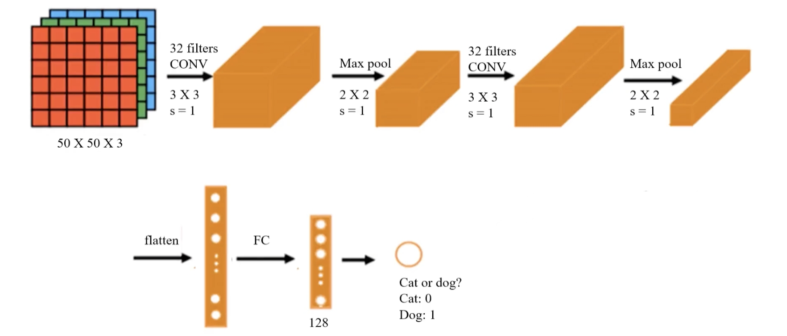

# 2.3. Convolutional Neural Network (CNN) Practice (Basic) - Cat and Dog Photo Binary Classification

This article follows from [2.2. Convolutional Neural Network (CNN) Model Theory (Advanced) - Image Padding, LeNet, and AlexNet](<../2.2/2.2. Convolutional Neural Network (CNN) Model Theory (Advanced) - Image Padding, LeNet, and AlexNet.md>), so if you have not read it yet, it is recommended to read that first.

## 2.3.1. Preparation
Please enter the following command in the terminal to download and install:
```bash
pip install keras tensorflow
```

Our task is binary classification of cats and dogs, so we will use cat and dog photos. Here we use a [Kaggle Cats and Dogs Classification Dataset](https://www.kaggle.com/datasets/bhavikjikadara/dog-and-cat-classification-dataset). After downloading, unzip it first. In the `train` folder, create two folders named `cat` and `dog`, put the cat photos into `cat`, and put the dog photos into `dog`. The final path should look like this:
```
.\train
	\train
		\dog
			\dog.0.jpg
			\dog.1.jpg
			\dog.2.jpg
			...
		\cat
			\cat.0.jpg
			\cat.1.jpg
			\cat.2.jpg
			...
```
Just drag the `train` folder directly into your Python project folder.

## 2.3.2. Overall Architecture
The overall CNN model is shown below:



1. **Input layer**:
- The input size is **50 × 50 × 3**, meaning the input image is 50×50 pixels with 3 channels (RGB color image).

2. **First convolution layer (Conv Layer 1)**:
- Uses **32 3×3 convolution kernels** with stride = 1.
- This layer extracts low-level features such as edges and textures.
- The convolution layer uses the ReLU function.

3. **First pooling layer (Max Pooling 1)**:
- **Pooling kernel size 2×2**, stride = 2 (Keras default: stride equals `pool_size`).
- Max pooling reduces the size of the feature maps, improves computational efficiency, and increases feature robustness.

4. **Second convolution layer (Conv Layer 2)**:
- Uses **32 3×3 convolution kernels** again, stride = 1.
- Continues to extract higher-level features such as contours and shapes.
- The convolution layer uses the ReLU function.

5. **Second pooling layer (Max Pooling 2)**:
- **Pooling kernel size 2×2**, stride = 2.
- Further reduces the size of the feature maps and reduces computation.

6. **Flatten layer**:
- After two rounds of convolution and pooling, the feature maps are flattened into a one-dimensional vector for input to the fully connected layer.

7. **Fully connected layer (FC)**:
- A **128-dimensional fully connected layer** is used to learn the final classification decision.

8. **Output layer**:
- The final output is a **single neuron**, representing the binary classification problem (cat or dog).
- **Output 0 means cat, output 1 means dog**.

## 2.3.3. Write the Code
### Step 1: Load Images and Preprocess
```python
# Image loading and preprocessing
from keras.preprocessing.image import ImageDataGenerator

train_datagen = ImageDataGenerator(rescale=1./255)
training_set = train_datagen.flow_from_directory('.\\train\\train',
                                                 target_size=(50, 50),
                                                 batch_size=128,
                                                 class_mode='binary')
```
- `ImageDataGenerator` is a tool for image data augmentation and preprocessing. It can generate richer training data through a series of transformations such as rotation, shifting, and scaling, thereby improving the generalization ability of deep learning models.

- `train_datagen` is an instance of `ImageDataGenerator`:
  - `rescale=1./255` scales the pixel values of the images. Raw pixel values are usually in the range `[0, 255]`. By setting this parameter, the pixel values are normalized to the `[0, 1]` range for faster convergence and more stable training.
  - `ImageDataGenerator` has more parameters as well, and can also perform scaling, shifting, rotation, and more.

- By calling `flow_from_directory()`, images are loaded from the specified directory and prepared as a training dataset:
  - The `target_size` parameter specifies the target size of the images when they are loaded. This will resize all images to a consistent size, which here is 50×50 pixels.
  - The `batch_size` parameter specifies the batch size of images loaded from the generator each time. In deep learning, training data is usually split into several batches, and this parameter defines how many images are included in each batch. Here, `batch_size=128` means the generator will produce 128 images and their labels at a time. A larger `batch_size` usually means higher training efficiency. However, if your GPU memory is too small, you can reduce it appropriately (32 is a very good configuration), though that may lead to unstable convergence.
  - The `class_mode` parameter is set to `'binary'`, which means this is a **binary classification problem**, and the generated labels will be binarized, i.e. 0 or 1. If set to `'categorical'`: used for multi-class problems, labels are one-hot encoded, for example `[1, 0, 0]` indicates the first class. If set to `'sparse'`: similar to `'categorical'`, but the labels are integer values rather than one-hot vectors, for example `0`, `1`, `2`. If set to `None`: no labels are returned, which is usually used for unsupervised learning or prediction (inference) stages.

*Note: the path syntax above is for Windows. If you are on macOS/Linux, please use `./train/train`.*

### Step 2: Build the CNN Model
Based on the architecture above, let us build the CNN model:
```python
# Build the model
from keras.models import Sequential
from keras.layers import Conv2D, MaxPooling2D, Flatten, Dense

model = Sequential()
# Convolution layer
model.add(Conv2D(32, (3,3), input_shape=(50,50,3), activation='relu'))
# Pooling layer
model.add(MaxPooling2D(pool_size=(2,2)))
```
Explanation of the `Conv2D` parameters:
- **`32 (filters)`**:
  - Indicates that this layer uses **32 convolution kernels (filters)**.
  - Each kernel extracts different features, so the number of feature maps extracted is the same as the number of kernels. The final output is 32 feature maps.
- **`(3, 3)`**:
  - Specifies the convolution kernel size as **3x3** pixels (usually a small size such as `(3, 3)` or `(5, 5)` is used).
  - The convolution kernel slides over the input image to extract local features.
- **`input_shape=(50,50,3)`**:
  - Indicates the shape of the input data: **`50x50`** is the image resolution (width, height), and **`3`** is the number of channels. Images usually have 3 color channels (RGB). This is the CNN input requirement, so you must make sure the preprocessed image data matches this shape.
- **`activation='relu'`**: the activation function is ReLU (Rectified Linear Unit), which turns negative values into 0 and keeps positive values unchanged.

Explanation of the `MaxPooling2D` parameters:
- **`pool_size=(2,2)`**:
  - Specifies the pooling window size as **2x2** pixels.
  - In each 2x2 window, the maximum value is retained (that is, max pooling), and the other values are discarded.
  - Pooling shrinks the image width and height by half. With valid padding, the first convolution layer output size is `48x48`, and after pooling it becomes `24x24`.

At this point we have only written the first convolution + pooling layer. Let us continue with the second convolution + pooling layer:
```python
# Second convolution + pooling layer
model.add(Conv2D(32, (3,3), activation='relu'))
model.add(MaxPooling2D(pool_size=(2,2)))
```
- `Conv2D` here does not need the `input_shape` parameter because the code can infer the output size of the previous layer automatically.

At this point, the feature extraction part of the image is complete. Next, we flatten the features into a one-dimensional vector for the MLP model to consume:
```python
# Flatten layer
model.add(Flatten())
```

Then we write the MLP architecture (two fully connected layers, with 128 neurons in the hidden layer, and one neuron in the output layer for binary classification):
```python
# Fully connected layer
model.add(Dense(units=128, activation='relu'))
model.add(Dense(units=1, activation='sigmoid'))
```

### Step 3: Train the Model
The next operations are the same as when using only an MLP model: configure the core training parameters:
```python
# Configure training
model.compile(optimizer='adam', loss='binary_crossentropy', metrics=['accuracy'])

# View the model structure
model.summary()
```
- `compile` is a Keras model method used to configure the model’s learning process before training. Its main parameters are:
  - **Loss function (`loss`)**: defines how error is computed during training.
  - **Optimizer (`optimizer`)**: determines how model parameters such as weights and biases are updated to minimize the loss function.
  - **Evaluation metric (`metrics`)**: determines the metric used to evaluate model performance. These metrics do not affect training; they are only used to measure results.

- **`loss='binary_crossentropy'`**: `binary_crossentropy` is a commonly used loss function for binary classification tasks.
- **`optimizer='adam'`**: **`adam`** (Adaptive Moment Estimation) is an adaptive learning-rate optimization algorithm and one of the most commonly used optimizers in deep learning.
- **`metrics=['accuracy']`**: specifies accuracy as the metric used to measure performance during training and evaluation.

Output:
```
Model: "sequential"
┏━━━━━━━━━━━━━━━━━━━━━━━━━━━━━━━━━┳━━━━━━━━━━━━━━━━━━━━━━━━┳━━━━━━━━━━━━━━━┓
┃ Layer (type)                    ┃ Output Shape           ┃       Param # ┃
┡━━━━━━━━━━━━━━━━━━━━━━━━━━━━━━━━━╇━━━━━━━━━━━━━━━━━━━━━━━━╇━━━━━━━━━━━━━━━┩
│ conv2d (Conv2D)                 │ (None, 48, 48, 32)     │           896 │
├─────────────────────────────────┼────────────────────────┼───────────────┤
│ max_pooling2d (MaxPooling2D)    │ (None, 24, 24, 32)     │             0 │
├─────────────────────────────────┼────────────────────────┼───────────────┤
│ conv2d_1 (Conv2D)               │ (None, 22, 22, 32)     │         9,248 │
├─────────────────────────────────┼────────────────────────┼───────────────┤
│ max_pooling2d_1 (MaxPooling2D)  │ (None, 11, 11, 32)     │             0 │
├─────────────────────────────────┼────────────────────────┼───────────────┤
│ flatten (Flatten)               │ (None, 3872)           │             0 │
├─────────────────────────────────┼────────────────────────┼───────────────┤
│ dense (Dense)                   │ (None, 128)            │       495,744 │
├─────────────────────────────────┼────────────────────────┼───────────────┤
│ dense_1 (Dense)                 │ (None, 1)              │           129 │
└─────────────────────────────────┴────────────────────────┴───────────────┘
 Total params: 506,017 (1.93 MB)
 Trainable params: 506,017 (1.93 MB)
 Non-trainable params: 0 (0.00 B)
```

Next, feed the data into the model:
```python
# Train the model
model.fit(training_set, epochs=25)
```
- `epochs` determines the number of training iterations.

### Step 4: Evaluate the Model
Let us see its prediction accuracy on the training data:
```python
# Calculate the model prediction accuracy
accuracy_train = model.evaluate(x=training_set)
print("\nAccuracy on training set: ", accuracy_train[1])
```

Output:
```
Accuracy on training set: 0.9990400075912476
```
You can see that the accuracy is very high.
