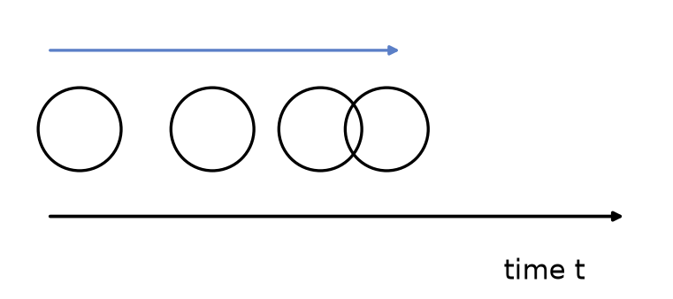
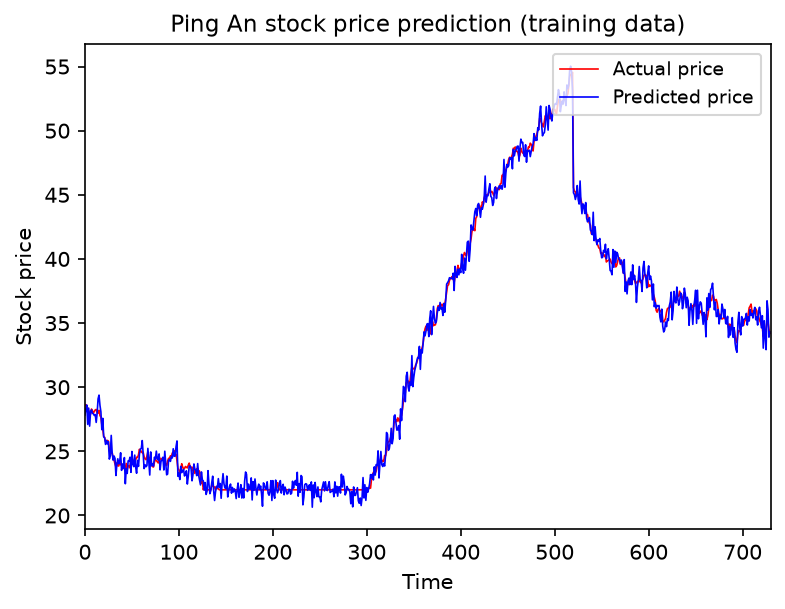

# 3.1. Sequence Model

## 3.1.1. Some Examples
Let's look at some real-world applications of sequence models:
- Automatically writing an article from a title
- Automatically finding names in a sentence
- ...

Their common core is **making predictions based on text content and the information before and after it**.

Let's look at another example:

There is a ball moving in one direction, but its speed is not fixed. I want the computer to predict where the ball is at a certain moment. If we had such an algorithm, we could use visual monitoring to anticipate human behavior.

The core of this problem is **making predictions based on the object's state at different moments in time**.

Finally, one more example:

Using historical stock prices to predict tomorrow's stock price. Although it is impossible to predict it very accurately, as long as the trend is right, it can still help investors make decisions.

The core of this problem is **making predictions based on historical data**.

---

These three examples all have one thing in common: **they estimate outcomes from sequential data with an order relationship**.

This kind of problem can be handled by a ***sequence model***.

## 3.1.2. What Is a Sequence Model
**Sequence models** are a class of machine learning models designed specifically to handle **time-series data or ordered data**. They can capture **temporal dependencies** in input data and are widely used in **natural language processing (NLP), speech recognition, and time-series forecasting**.

Common sequence models include:
- **RNNs (Recurrent Neural Networks)**: able to process variable-length input, but they suffer from vanishing gradients.
- **LSTMs (Long Short-Term Memory networks)** and **GRUs (Gated Recurrent Units)**: improvements over RNNs that capture long-range dependencies better.
- **Transformers**: based on the self-attention mechanism, they have surpassed RNNs/LSTMs in NLP tasks and have become the mainstream architecture today, such as BERT and GPT.

Their main characteristics are:
- The elements in the input and output sequences have an order. Different orders should produce different results. For example, "not eating" and "eating not" have different meanings.
- The lengths of the input and output can vary. Examples include article generation and chatbots.

Their main application areas are:
- Speech recognition
- Language translation
- Stock price prediction
- Behavior prediction

One fun fact: the **Transformer** architecture was originally designed for **natural language processing (NLP)** tasks, especially **machine translation**. It first appeared in Google's 2017 paper **"Attention Is All You Need"**, which completely changed the NLP field.

In the next article, [3.2. Recurrent Neural Network (RNN) Theory (Basic)](<../3.2/3.2. Recurrent Neural Network (RNN) Theory (Basic).md>), we will learn about the most widely used sequence model before the Transformer era: the RNN, or recurrent neural network.
