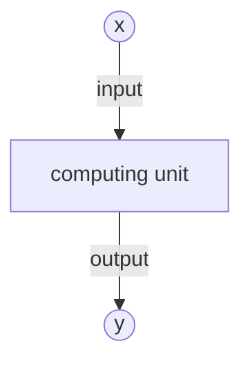
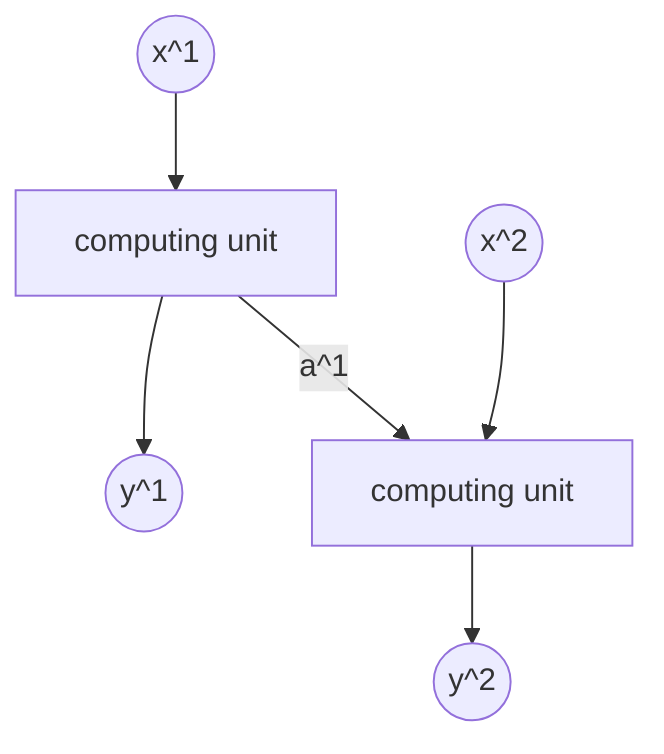
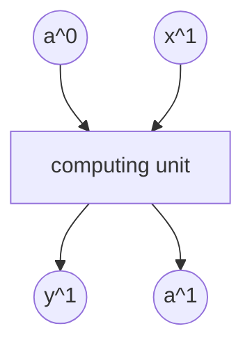
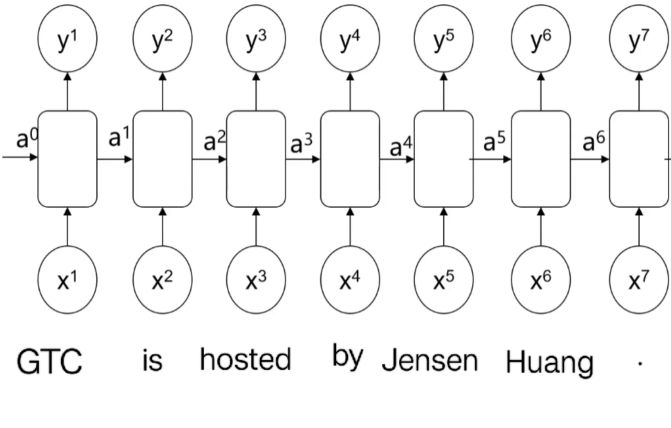

# 3.2. Recurrent Neural Network (RNN) Theory (Basic)

## 3.2.1. What Is a Recurrent Neural Network (RNN)
A **recurrent neural network** (RNN) is a neural network used to process sequence data, such as time series, text, and speech. Unlike ordinary feedforward neural networks, RNNs have a kind of **"memory"** and can retain past information to influence the current output. That makes them very suitable for **temporal data** and **natural language** tasks.

To understand RNNs, we first need to review the MLP model. Here is a simplified model:

`x` is taken as input and passed into the computing unit, where several neurons in each layer produce the output `y`. An RNN, however, feeds the result of the previous computation into the next computation as a new parameter:

- $x^1$ and $x^2$ are inputs at two time steps.
- The computing unit processes the data at each time step and outputs $y^1$ and $y^2$.
- The **hidden state** $a^1$ **is passed across time steps**, meaning information from the previous step flows into the next step. The hidden state is computed from the **previous hidden state and the current input**.

## 3.2.2. The Mathematical Model of RNNs
### Basic Architecture
Let's look at the basic architecture of an RNN:

### $a^0$: Initial Hidden State
- This is the **initial value of the hidden state at the first time step**.
- It is **usually set to a zero vector** (all zeros), or it can be randomly initialized: $a^0 = \mathbf{0} \quad \text{(default)}$
- Purpose: provide an initial memory so that the RNN has temporal characteristics.

### $x^1$: Input at the First Time Step
- The sequence input processed by the RNN, namely the data at the first time step.
- It may be:
  - **Text tasks**: the first word in a sentence, such as "Hello"
  - **Time series**: the first time point in stock data
  - **Speech recognition**: the first frame of an audio segment
- This input is used together with the hidden state $a^0$ to compute the new hidden state $a^1$.

### Computing Unit
- The core unit of an RNN uses the **previous hidden state** $a^0$ **and the current input** $x^1$ to compute:
  - **a new hidden state** $a^1$ (memory passing)
  - **the output at the current time step** $y^1$ (prediction)
- **Formulas:**
$$
a^1 = f(W_h a^0 + W_x x^1 + b)
$$
$$
y^1 = g(W_y a^1 + c)
$$
- $W_h$, $W_x$, and $W_y$ are weight matrices
- $b$ and $c$ are bias terms
- $f$ (commonly `tanh`) is the activation function for the hidden state
- $g$ (such as `softmax`) is the output mapping

This article uses the common form above: first update the hidden state $a^1$, then compute the output $y^1$ from $a^1$. Some materials write an equivalent variant that maps $a^0$ and $x^1$ to $y^1$ in one step; the meaning is the same once the weight matrices are defined consistently.

### $y^1$: Output at the First Time Step
- This is the **main output of the computing unit**, representing the prediction result at the current time step
- For different tasks:
  - Language models such as GPT: $y^1$ may be the **probability distribution for the next word**
  - Machine translation: $y^1$ may be the **first word in the target language**
  - Speech recognition: $y^1$ may be a **phoneme** or a **word**
- **Formula:**
$$
y^1 = g(W_y a^1 + c)
$$
  - Here, $g$ may be **softmax** for classification tasks, or linear activation for regression tasks

### $a^1$: Updated Hidden State
- **The memory information for the next time step**, used to carry historical information to $t=2$
- **Formula:**
$$
a^1 = f(W_h a^0 + W_x x^1 + b)
$$
  - This value is passed to the next time step $t=2$ to compute $a^2$ and $y^2$

### And So On
The two most important formulas are the ones for the two outputs:
$$
a^1 = f(W_h a^0 + W_x x^1 + b)
$$
$$
y^1 = g(W_y a^1 + c)
$$
- $W_h$, $W_x$, and $W_y$ are weight matrices
- $b$ and $c$ are bias terms
- $f$ (commonly `tanh`) is the activation function for the hidden state
- $g$ (such as `softmax`) is the output mapping

What we need to do is repeat this process over and over:
$$
a^i = f(W_h a^{i-1} + W_x x^{i} + b)
$$
$$
y^i = g(W_y a^i + c)
$$

## 3.2.3. Computers and RNNs
So what do we want the computer to calculate in an RNN model? Looking at the two formulas above, the unknown parameters are the weight matrices $W_h$, $W_x$, and $W_y$.

The method for computing these parameters is the same as in MLPs: use training data and labels to backpropagate gradients, and find the weight matrices $W_h$, $W_x$, and $W_y$ that minimize the loss function.

## 3.2.4. Example
Let's use an example to deepen our understanding of RNNs:

> Automatically find the names in a sentence: GTC is hosted by Jensen Huang.

First, let's define our inputs—each word (including punctuation) corresponds to one input data point:

| Input    | Word     |
| ----- | -------- |
| $x_1$ | "GTC"    |
| $x_2$ | "is"     |
| $x_3$ | "hosted" |
| $x_4$ | "by"     |
| $x_5$ | "Jensen" |
| $x_6$ | "Huang"  |
| $x_7$ | "."      |

How should the labels be written? Each input corresponds to one output. Since we want to find names, inputs that are part of a name are 1, and the rest are 0:

| Input    | Word     | Output |
| ----- | -------- | --- |
| $x_1$ | "GTC"    | 0   |
| $x_2$ | "is"     | 0   |
| $x_3$ | "hosted" | 0   |
| $x_4$ | "by"     | 0   |
| $x_5$ | "Jensen" | 1   |
| $x_6$ | "Huang"  | 1   |
| $x_7$ | "."      | 0   |

But computers do not understand words directly; what they see are encodings. So we need to convert words into a form that the computer can understand—numbers. In other words, we build a dictionary that maps input words to numerical vectors and convert each input word into the corresponding dictionary value.

How should we build this dictionary? The simplest and most direct way is to create a dictionary that covers all words, and the two case variants of the same first letter should be treated as separate entries:
$$
\left\{
\begin{array}{ll}
\textit{a} & : 1 \\
\textit{am} & : 2 \\
\vdots & \vdots \\
\textit{by} & : x \\
\vdots & \vdots \\
\textit{is} & : y \\
\textit{hosted} & : z \\
\vdots & \vdots
\end{array}
\right\}
$$

We use the one-hot encoding corresponding to each word as input. For example, the word `am` would be represented as:

| Index | Value |
| --- | --- |
| 0   | 0   |
| 1   | 1   |
| 2   | 0   |
| 3   | 0   |
| 4   | 0   |
| 5   | 0   |
| ... | 0   |

How do we build the model?

Seven inputs correspond to seven time steps (the same RNN cell and weights are reused at each step). Feed the one-hot encoded data and the corresponding labels to the model, and let the model back-calculate the weights.

When the computer back-calculates the weights, it needs to ensure that the loss function is minimized. The loss function for a single neuron is:
$$
\textit{loss}(i) = -y^i \log(y_{\textit{predict}}^i) - (1 - y^i) \log(1 - y_{\textit{predict}}^i)
$$
We add together the loss functions of all neurons and let the computer minimize the total in each iteration:
$$
\operatorname{minimize}( \sum_{i} \left[ -y^i \log(y_{\textit{predict}}^i) - (1 - y^i) \log(1 - y_{\textit{predict}}^i) \right])
$$
---

If you do not want to build a dictionary containing every English word, you can also build a dictionary for each character:
$$
\left\{
\begin{array}{ll}
\textit{a} & : 1 \\
\textit{b} & : 2 \\
\vdots & \vdots \\
\textit{z} & : 26 \\
\textit{A} & : 27 \\
\vdots & \vdots \\
\textit{1} & : 53 \\
\vdots & \vdots
\end{array}
\right\}
$$
This makes the dictionary smaller, but it places higher demands on the model.
