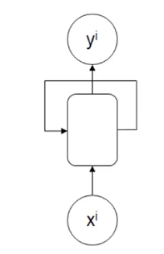
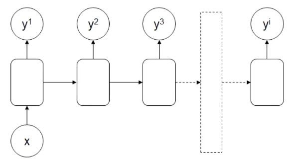
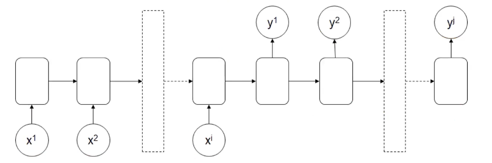
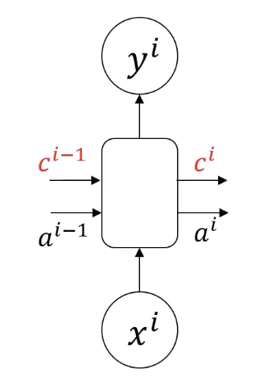
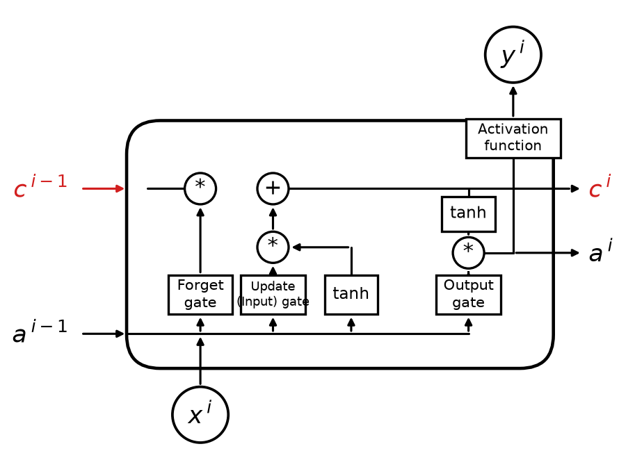

# 3.3. Recurrent Neural Network (RNN) Theory (Advanced)

This article continues from [3.2. Recurrent Neural Network (RNN) Theory (Basic)](<../3.2/3.2. Recurrent Neural Network (RNN) Theory (Basic).md>). If you have not read that one yet, it is recommended that you start there.

## 3.3.1. Basic RNN Structure
### Diagram
Let's first look at the most basic RNN structure:

On top of the MLP structure, some information from the earlier sequence is processed and then passed to the next sequence.

Sometimes you may also see this symbol:

This corresponds to the basic RNN structure and can be used to represent an RNN model. Compared with an MLP, it has one extra arrow indicating self-recurrence.

### Inputs & Outputs
- Inputs: $x^1, x^2, x^3, \dots, x^i$
- Outputs: $y^1, y^2, y^3, \dots, y^i$

The feature here is that the input and output sequences are the same length: if there are $i$ inputs, there are also $i$ outputs. This is the RNN structure with **multiple inputs and multiple outputs of the same dimension**.

### Main Applications
Recognizing specific information, such as identifying which words in a sentence are names.

## 3.3.2. RNN Architecture with Multiple Inputs and One Output
### Diagram

### Inputs & Outputs
- Inputs: $x^1, x^2, x^3, \dots, x^i$
- Output: $y^1$

### Main Applications
Sentiment recognition: if I have the sentence "I feel happy and positive.", the computer needs to determine whether this sentence expresses positive or negative sentiment.

## 3.3.3. RNN Architecture with One Input and Multiple Outputs
### Diagram

### Inputs & Outputs
- Input: $x^1$
- Outputs: $y^1, y^2, y^3, \dots, y^i$

It is generally used as a **sequence data generator**.

### Main Applications
- Article generation: given a title, generate a paragraph.
- Music generation: choose parameters such as style or emotion and output music.

## 3.3.4. RNN Architecture with Multiple Inputs and Multiple Outputs
### Diagram

How is this different from the basic RNN architecture? The difference is that the number of input items and output items does not have to be the same.

### Inputs & Outputs
- Inputs: $x^1, x^2, x^3, \dots, x^i$
- Outputs: $y^1, y^2, y^3, \dots, y^j$

### Main Applications
Its main application is machine translation, although Transformers have now basically replaced RNNs. For example, consider the following sentence:
*"What is artificial intelligence?"* (4 words, not counting punctuation)

The computer translates it into Chinese:
*"什么是人工智能？"* (7 Chinese characters, not counting punctuation)

Here, the number of input and output words is different.

## 3.3.5. Limitations of the Vanilla RNN Structure
Vanilla RNNs all have structural limitations. As early sequence information is passed to later positions, its weight gradually decreases, which causes important information to be lost.

Let's look at a simple example (fill in the past tense):

1. *"The student, who got A+ in the exam, ___ excellent."*
2. *"The students, who got A+ in the exam, ___ excellent."*

The first sentence clearly takes *was* because of the keyword "student", and the second clearly takes *were* because of the keyword "students".

However, an RNN loses information at each transfer, so by the end the difference between "student" and "students" may no longer be reflected.

To address this problem, we need to increase the decision weight of important early information.

## 3.3.6. Introduction to Long Short-Term Memory Networks (LSTM)
### Diagram

### Features
LSTM adds a memory cell $c^i$, which can pass along information from distant earlier positions. For example, the singular/plural difference between "student" and "students" in the example above can be stored in the memory cell.

In simpler terms: compared with $a^i$, the memory cell $c^i$ focuses on recording important early sequence information, and it loses less information during transfer.

## 3.3.7. A Deeper Look at LSTM

**1. Inputs and outputs**
- **Inputs:** The inputs of this LSTM unit include:
- The current input $x^i$
- The previous hidden state $a^{i-1}$
- The previous cell state $c^{i-1}$ (marked in red)

- **Outputs:**
  - The current hidden state $a^i$
  - The current cell state $c^i$ (marked in red)
  - The output $y^i$ after the activation function

**2. Key computation units**
The key components of LSTM are the **forget gate**, **input gate**, **output gate**, and a new way of computing the cell state:

**(1) Forget Gate**
- Role: decide which information should be forgotten from the previous cell state $c^{i-1}$.
- Computation:
$$
f^i = \sigma(W_f [a^{i-1}, x^i] + b_f)
$$
  - Here, $\sigma$ is the sigmoid activation function
  - $W_f$ is the weight matrix and $b_f$ is the bias term
  - The resulting $f^i$ lies between 0 and 1 and represents the forgetting ratio

**(2) Input Gate**
- Role: decide which new information should be added to the cell state.
- Computation:
$$
g^i = \tanh(W_g [a^{i-1}, x^i] + b_g)
$$
  - Here, $g^i$ represents new information, also called the candidate cell state, and is normalized with tanh.

- At the same time, another gating mechanism determines the proportion of information to add:
$$
i^i = \sigma(W_i [a^{i-1}, x^i] + b_i)
$$
  - $i^i$ is also a value produced by sigmoid and represents how much this information affects the new cell state.

Cell state update:
$$
c^i = f^i \cdot c^{i-1} + i^i \cdot g^i
$$
  

**(3) Output Gate**
- Role: decide the value of the current hidden state, that is, $a^i$.
- Computation:
$$
o^i = \sigma(W_o [a^{i-1}, x^i] + b_o)
$$
  - Here, $o^i$ controls how much of the state is output.

Compute the final hidden state:
$$
a^i = o^i \cdot \tanh(c^i)
$$

**3. Key connection explanation**
- The red $c^i$ and $c^{i-1}$ indicate the transmission of the LSTM cell state
- $a^i$ and $a^{i-1}$ are the hidden-state transfers used at the next time step
- The input $x^i$ passes through multiple gates to control its information flow
- Activation functions such as tanh play a normalization role in the cell state and output gate

## 3.3.8. Deep Recurrent Neural Networks (DRNN)
To solve more complex sequence tasks, you can stack single-layer RNNs or combine them with an ordinary MLP structure before the output:

**1. Left: Single-layer RNN**
- This is the most basic RNN structure. The input depends on the time step, and the hidden layer propagates information through time
- Black nodes indicate hidden states, and arrows indicate the direction of information flow
- Because it only has one hidden layer, this structure has limitations when modeling complex sequences

**2. Middle: Multi-layer RNN**
- This structure preserves the RNN property along the **time dimension** while stacking multiple hidden layers along the **depth dimension**
- The hidden state of a lower layer is not only connected to the next time step, but is also passed upward as input to the next hidden layer, allowing the model to learn representations at different levels (lower layers learn local patterns, higher layers learn long-term dependencies)
- This gives the model greater expressive power and enables it to extract more complex features

**3. Right: Fully Connected Deep RNN**
- This structure further strengthens the network's modeling capability. The hidden state of each layer is connected to the next layer and also propagated across time steps
- Such a structure can better capture long-term dependencies while using depth to improve feature learning

**Key features of DRNN**
- **Deep structure**: compared with a single-layer RNN, a DRNN has multiple hidden layers, allowing the model to learn different feature representations at different levels and improving expressiveness
- **Stronger feature learning**: stacking layers helps the network learn hierarchical temporal features. Vanishing gradients along time and depth can still occur, so LSTM/GRU cells or residual connections are often used in practice
- **Hierarchical information flow**: information is propagated across different time steps and different layers, improving prediction capability

We will take a deeper look at this in the practical section later.
