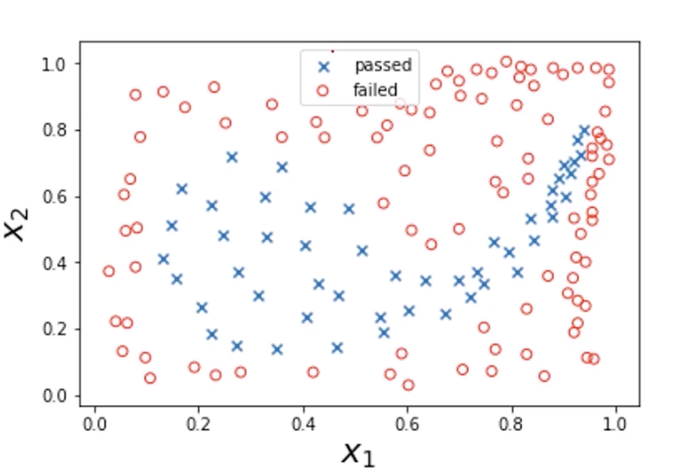
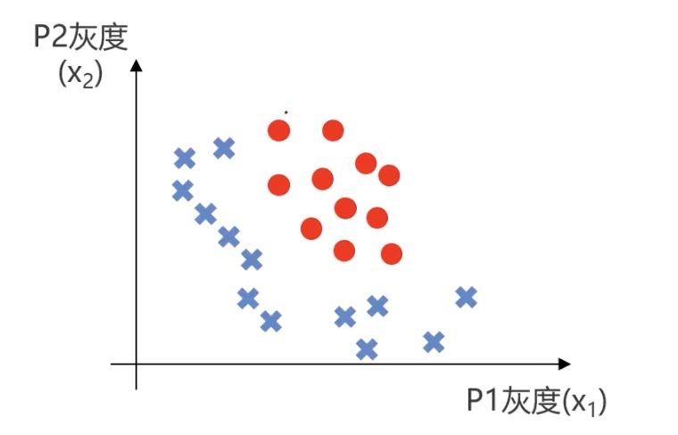
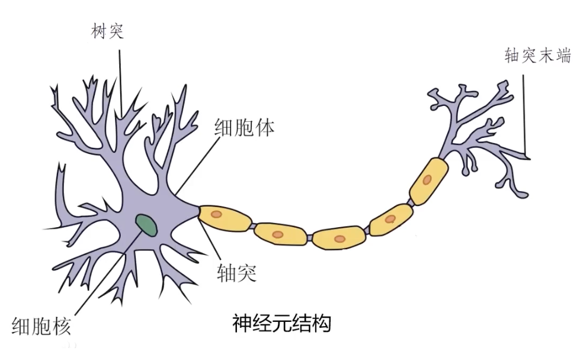
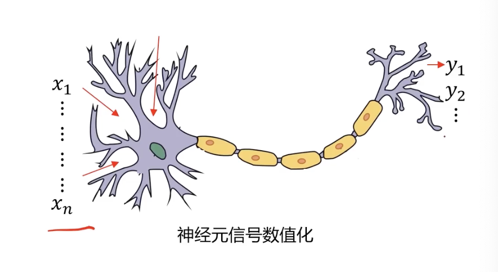
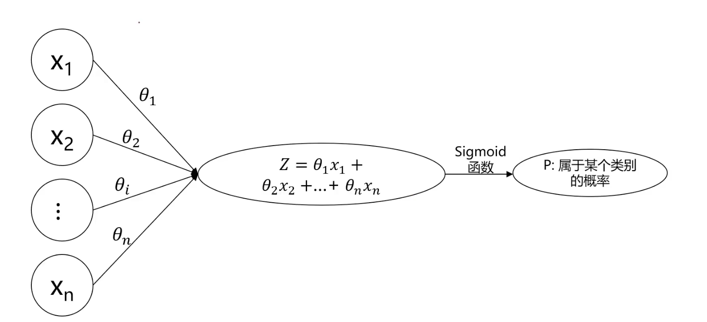
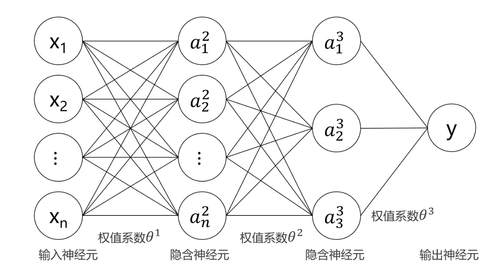

# 1.1. 多层感知器MLP(人工神经网络)介绍

## 1.1.1. 为什么需要多层感知器
我们之前学过很多机器学习的算法，为什么还要学这个多层感知器呢？

看个例子：

> 根据检测数据$x_1$、$x_2$及其标签，判断$x_1 = 0.7$、$x_2 = 0.6$时所属的类别

通常来说我们可以建立一个逻辑回归模型来找到决策边界。但是这里的边界明显非常复杂，使用逻辑回归需要生成指数和项数都非常多的多项式。

而现实中的实际数据只可能比这个更加复杂，而且因子也会更多。如果我们这个时候还是使用逻辑回归运算速度就会非常慢。

---

再举一个例子：

>自动识别图片中的动物是猫还是狗

人能够非常直观地分辨出哪个是猫哪个是狗，但计算机不行，照片在计算机眼中只是一堆像素点。

我们先把任务进行简化，假如我就在每张图上取两个固定点$P_1$、$P_2$，得到这两个点的灰度值(Gray Scale)，然后把这些数据放到平面直角坐标系中：

假如说红色的点代表猫，蓝色的叉代表狗，那么就让计算机通过逻辑回归找到分辨猫和狗的决策边界。这里由于我们简化了任务，所以决策边界看着不是很复杂，用逻辑回归也能完成。

但在实际的任务中我们会把一个照片的所有像素点的灰度数值给计算机。假如说这里有400x500大小的照片，那么就会有20万个散点数据。这时候用逻辑回归，模型的二次项数量($x_i \times x_j$)会超过百亿个($\frac{200000 \times 199999} {2}$)

---

这些传统机器学习无法很好处理的问题就需要MLP来处理了。

## 1.1.2. 多层感知器(人工神经网络)的核心
多层感知器(人工神经网络)的核心就在于像人一样思考。那么人是怎么思考的呢？

这里涉及到一点生物知识：

神经系统中最基础的结构和功能单位就是神经元。

其中最核心的两个部分就是树突和轴突末端：
- 树突：接受上一个神经的轴突释放的化学物质（递质），使该神经产生电位差形成电流传递信息
- 轴突：释放递质给下一个神经元，实现信息传递

而多层感知器（人工神经网络）就是模仿这个基本结构：

将数据传入这个“神经元”，经过某种处理（某个公式），输出新的数据。

其实这个流程与逻辑回归的架构非常像：

把输入数据经过公式处理得出$P$，而不同的$P$值就可以对应不同的情况。

人的大脑中有许多的神经元组成了神经网络，而多层感知器也正是依靠许多的“逻辑回归结构”叠加形成人工神经网络。

## 1.1.3. 多层感知器MLP数学表达式
输入神经元就是输入数据，输出神经元的值就确定了属于某个类别的概率。我们知道了每一个神经元节点都是一个逻辑回归模型，就可以推导出被夹在输入神经元和输出神经元中的这些隐含神经元，这里我们以$a_2^2$为例：
$$
a_2^2 = g\left(\theta_{20}^{1} x_0 + \theta_{21}^{1} x_1 + \theta_{22}^{1} x_2 + \theta_{23}^{1} x_3 \right)
$$
  
- $a_2^2$：表示**第二层（隐藏层）第2个神经元的激活值**（即输出）
- $g(\cdot)$：表示**激活函数**，例如Sigmoid、ReLU、tanh等。用于引入非线性，使模型能学习复杂关系
- $\theta_{ij}^{1}$：表示**第一层到第二层之间的权重**，这里的上标1表示**这是第一层的权重矩阵**（通常是输入层到隐藏层的权重）。例如，$\theta_{21}^{1}$代表从输入层第1个输入节点到隐藏层第2个神经元的权重。
- $x_0$, $x_1$, $x_2$, $x_3$ ：表示输入值，其中$x_0$通常是**偏置项**，一般取值为1。

一些名词解释：
- Sigmoid、ReLU、tanh：一些计算非线性变化的公式。其中Sigmoid就是逻辑回归中采用的公式$P(x) = \frac{1}{1 + e^{-x}}$，ReLU和tanh我们会在之后涉及
- 偏置项就像是一个“**自由调整的数**”，它可以让神经元在没有输入（或输入为零）时仍然有一个非零的输出，用于**调整神经元的激活值**

我们只要一层一层地这么算每一个神经节点就能得到最终的$y$。

我们需要计算机做的就是根据分类好的数据反推权重。