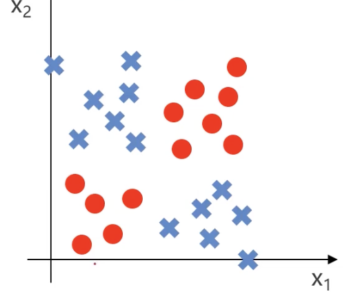
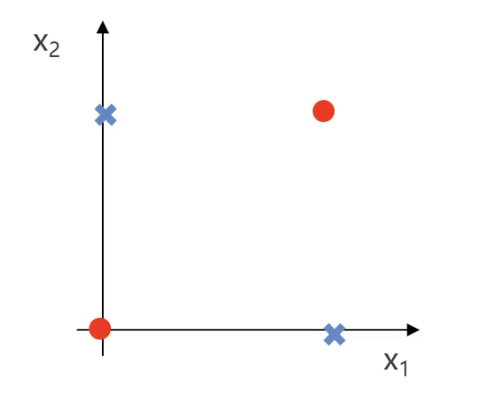
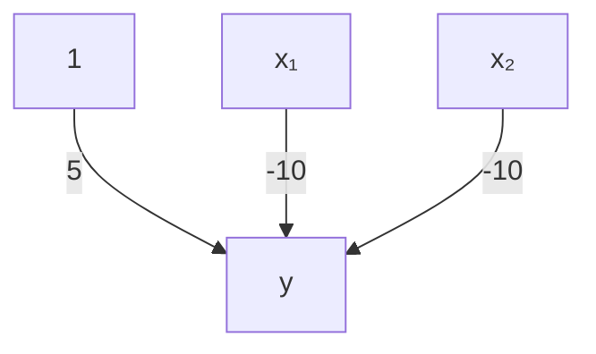
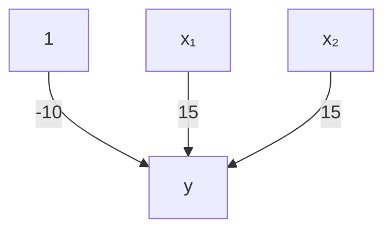
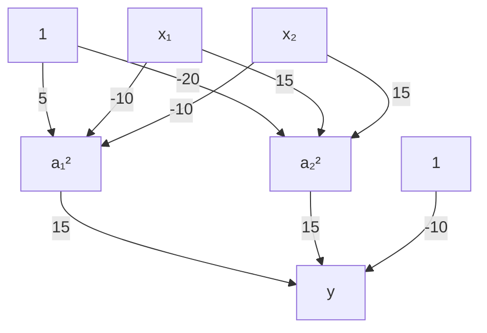
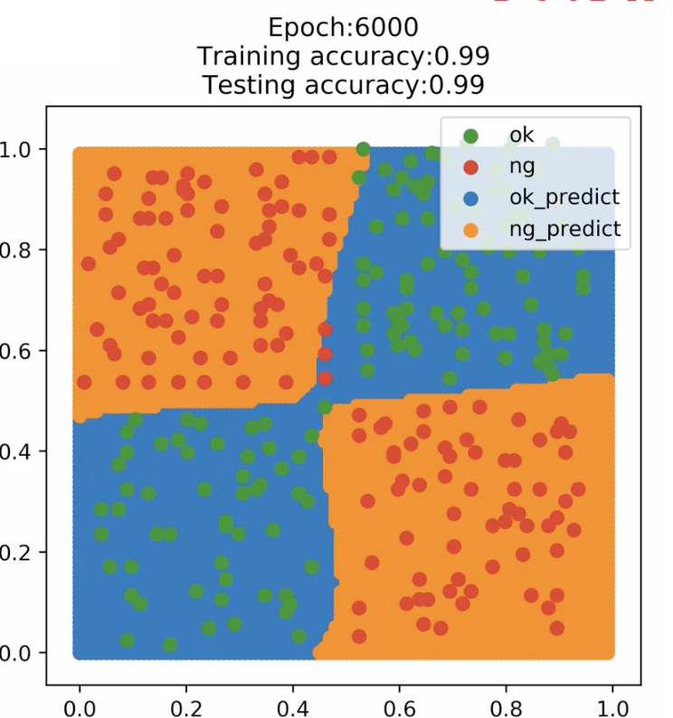
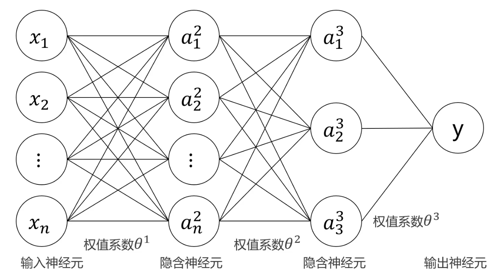
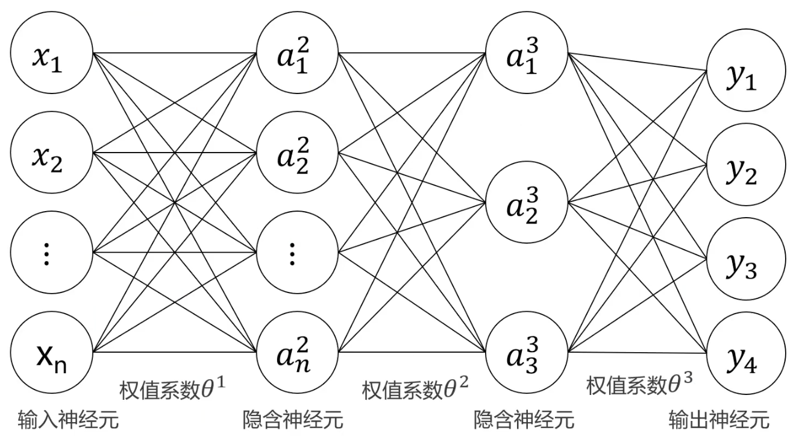

# 1.2. 多层感知器MLP(人工神经网络)实现非线性分类理论

本文承接自上一篇文章 [1.1. 多层感知器MLP(人工神经网络)介绍](<../1.1/1.1. 多层感知器MLP(人工神经网络)介绍.md>)，建议先看上一篇文章。
## 1.2.1.  MLP vs. 逻辑回归
MLP能做到的事逻辑回归也可以。逻辑回归的缺点在于需要增加高次项数据才可以完成非线性的分类，导致运行速度极慢。所以我们的目标就是在不增加高次项数据的情况下使用MLP完成分类。

## 1.2.2. 一个例子
我们来举个例子，假如我们的最终目标是对这些点进行分类：

我们可以先简化模型——红色点出现在左下角和右上角，蓝色点出现在左上角和右下角：

假设红色点值为1，蓝色点值为0，可以得到如下的真值表：

| X₁  | X₂  | y   |
| --- | --- | --- |
| 0   | 0   | 1   |
| 0   | 1   | 0   |
| 1   | 0   | 0   |
| 1   | 1   | 1   |
- $x_1$、$x_2$同为0或1时结果为1
- $x_1$、$x_2$不相等时结果为0

用专业的数学名词表达就是此时$y$为$x_1$和$x_2$的**同或门**($y: x_1 XNOR x_2$)。
## 1.2.3. 逻辑门
### 与门(AND)
上文所说的**同或门**就是逻辑门的一种，先讲一下**与门**($AND$)这个最基础的逻辑门：当$x_1$、$x_2$同时成立(为1)时结果才成立(为1)，其余情况不成立(为0)。

假如我们有以下几个输入因子：
$x_0 = 1$、$x_1$和$x_2$
- $x_0$通常是**偏置项**，一般取值为1。偏置项就像是一个“**自由调整的数**”，它可以让神经元在没有输入（或输入为零）时仍然有一个非零的输出，用于**调整神经元的激活值**

设每一个输入数据的权重分别是$\theta_{10}^1$、$\theta_{11}^1$、$\theta_{12}^1$，用权重乘以每个输入值后相加，再使用逻辑函数计算即可得到神经元的输出值：
$$
y = h(\theta, x) = g\left(\theta_{10}^{1} + \theta_{11}^{1} x_1 + \theta_{12}^{1} x_2\right)
$$
- $\theta_{ij}^{1}$：表示**第一层到第二层之间的权重**，这里的上标1表示**这是第一层的权重矩阵**（通常是输入层到隐藏层的权重）。例如，$\theta_{11}^{1}$代表从输入层第1个输入节点到隐藏层第1个神经元的权重。

其中：
$$
g(x) = \frac{1}{1 + e^{-x}}
$$

如果我们设定权重$\theta_{10}^1 = -20$、$\theta_{11}^1 = 15$、$\theta_{12}^1 = 15$，这个神经元就能实现**与门**。我们可以先把这些参数带入公式：
$$
h(\theta, x) = g\left(-20 + 15x_1 + 15x_2\right)
$$

我们把每种情况的值算出来：

| x₁  | x₂  | $h(\theta, x)$ | y   |
| --- | --- | -------------- | --- |
| 0   | 0   | $g(-20)$       | 0   |
| 0   | 1   | $g(-5)$        | 0   |
| 1   | 0   | $g(-5)$        | 0   |
| 1   | 1   | $g(10)$        | 1   |

只有$x_1$和$x_2$都是1的时候$y$值才是1，这说明这个神经元实现了**与门**。

### 既不是$x_1$也不是$x_2$
接下来我们来个复杂一点的逻辑门：既不是$x_1$也不是$x_2$应该怎么表示呢？这句话中的“不是”代表非门(NOT)，“也”代表与门(AND)。

所以它的逻辑门应该写成：$y$: $NOT(x_1)$ $AND$ $NOT(x_2)$

我们修改权重就能把上面的神经元改为输出既不是$x_1$也不是$x_2$的逻辑：
$$
h(\theta, x) = g\left(5 - 10x_1 - 10x_2\right)
$$

带数据进去算：

| x₁  | x₂  | $h(θ, x)$ | y   |
| --- | --- | --------- | --- |
| 0   | 0   | $g(5)$    | 1   |
| 0   | 1   | $g(-5)$   | 0   |
| 1   | 0   | $g(-5)$   | 0   |
| 1   | 1   | $g(-15)$  | 0   |

### 或门(OR)
如果我们想实现或门($y:$ $x_1$ $OR$ $x_2$)：$x_1$、$x_2$中任意一个是1最后的结果就是1，可以这么写权重：
$$
h(\theta, x) = g\left(-10 + 15x_1 + 15x_2\right)
$$

带数据进去算：

| x₁  | x₂  | $h(θ, x)$ | y   |
| --- | --- | --------- | --- |
| 0   | 0   | $g(-10)$  | 0   |
| 0   | 1   | $g(5)$    | 1   |
| 1   | 0   | $g(5)$    | 1   |
| 1   | 1   | $g(20)$   | 1   |

## 1.2.4. 逻辑门与MLP
$y:$ $x_1$ $AND$ $x_2$

$y$: $NOT(x_1)$ $AND$ $NOT(x_2)$

$y:$ $x_1$ $OR$ $x_2$

我们通过这些逻辑门的排列组合就能组成一个比较复杂的MLP模型从而实现最开始的**同或门**($y: x_1 XNOR x_2$)逻辑。

具体怎么做呢？逻辑是这样的：

这么看你可能有点懵，我来逐步解释：
- $a_1^2$的值是$x_1$和$x_2$的既不是$x_1$也不是$x_2$的结果
- $a_2^2$的值是$x_1$和$x_2$的与门结果
- $y$值是$a_1^2$和$a_2^2$的或门结果

我们带数据进去看一下这样写能否实现**同或门**的效果：

| x₁  | x₂  | a₁² | a₂² | $h(θ, x)$ | y   |
| --- | --- | --- | --- | --------- | --- |
| 0   | 0   | 1   | 0   | $g(5)$    | 1   |
| 0   | 1   | 0   | 0   | $g(-10)$  | 0   |
| 1   | 0   | 0   | 0   | $g(-10)$  | 0   |
| 1   | 1   | 0   | 1   | $g(5)$    | 1   |

## 1.2.5. 解决问题
我们刚刚解决的是简化后的模型的分类问题：

那么机器会如何迭代到类似于这个同或门效果呢？我们只需要让模型不断迭代就能得到最终例子的分类：

具体是怎么迭代的呢：
**(1) 随机初始化权重**
- MLP（多层感知机）最开始的权重是**随机初始化**的，这意味着一开始的决策边界是**随机的**，不一定有任何实际意义。

**(2) 前向传播计算输出**
- 计算输入$x_1$,$x_2$经过隐藏层和激活函数后的输出。
- 计算MLP的最终预测值$y$。
- 与真实标签$y_{\text{true}}$进行比较，计算损失函数（比如交叉熵损失或均方误差）。

**(3) 误差计算与反向传播**
- 通过**误差反向传播（Backpropagation）** 计算各个权重对误差的贡献。
- 通过**梯度下降（Gradient Descent）** 或Adam进行参数更新，使模型的预测更接近真实标签。

**(4) 经过几轮迭代**：
  - MLP 逐渐学习到哪些区域应该输出1，哪些区域应该输出0。
  - **隐藏层神经元**学习到基本特征，例如某些区域对应**与门（AND）**，某些区域对应**或门（OR）**，最终组合成XNOR模型。
  - 训练过程中，**决策边界逐渐向实际分类边界靠拢**，最终形成类似**非线性分隔面**（如图中蓝色与橙色区域的边界）。

## 1.2.6. MLP实现多分类
现实生活中数据不一定只有两种情况，会有很多种，这时候就要求MLP实现多分类。

我们来回忆一下MLP的基本框架：

我们可以通过输出若干个神经元来实现多分类。假如有4个类别，就设立4个输出神经元: $y_1$, $y_2$, $y_3$, $y_4$，我们输入数据之后就会得到4个神经元的输出，也就是数据属于每种情况的概率，我们选最大概率的那个作为预测结果即可，如下图：

