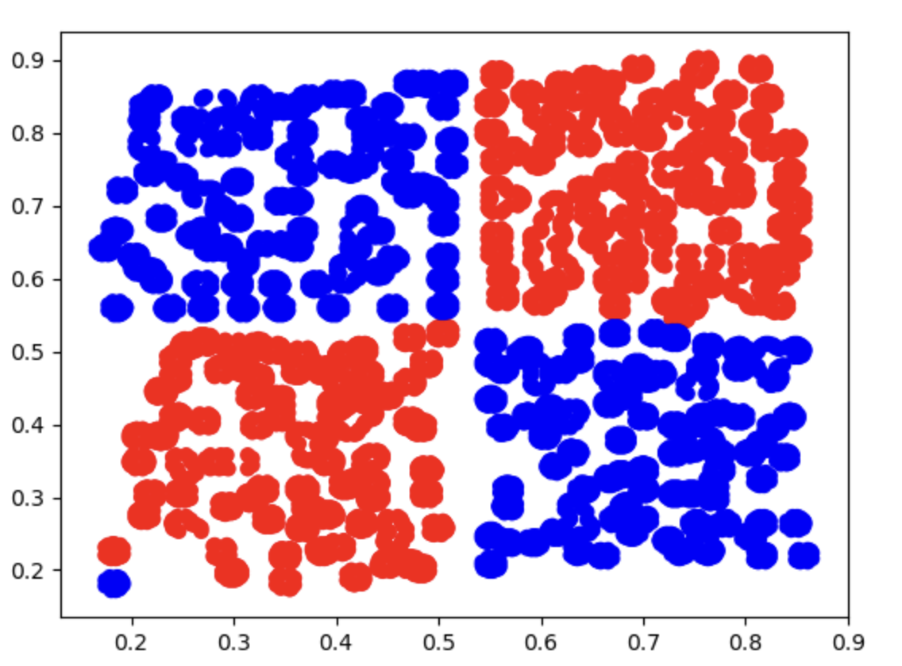
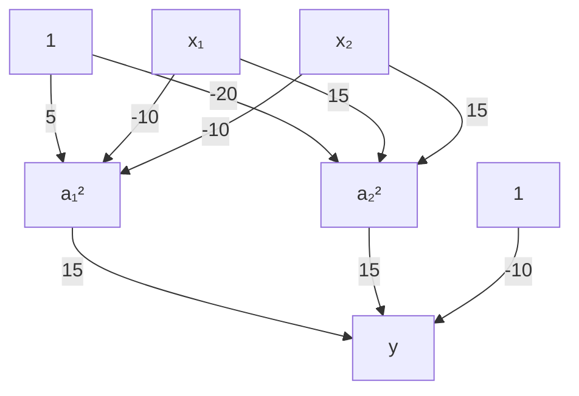

# 1.3. 利用Keras实现多层感知器MLP(人工神经网络)

本文承接自上一篇文章 [1.2. 多层感知器MLP(人工神经网络)实现非线性分类理论](<../1.2/1.2. 多层感知器MLP(人工神经网络)实现非线性分类理论.md>)，建议先看上一篇文章。

## 1.3.1. Keras
Keras 是一个用 Python 编写的用于神经网络开发的**应用接口**，调用该接口可以实现神经网络、卷积神经网络、循环神经网络等常用深度学习算法的开发。

特点：
- 集成了深度学习**中各类成熟的算法**，容易安装和使用，样例丰富，教程和文档也非常详细
- 能够以TensorFlow，或者Theano作为后端运行

我把[官方网址](https://keras.io/)附在这里。

## 1.3.2. Keras和TensorFlow的关系
Tensorflow是一个采用数据流图，**用于数值计算的开源软件库**，可自动计算模型相关的微分导数：非常适合用于神经网络模型的求解。

Keras可看作为tensorflow封装后的一个接口（Keras作为前端，TensorFlow作为后端）。Keras为用户提供了一个易于交互的外壳，方便进行深度学习的快速开发。

## 1.3.3. 下载并安装Keras和TensorFlow
请在终端输入指令以下载和安装：
```bash
pip install keras tensorflow
```

## 1.3.4. 准备工作
这里需要使用到我的`csv`文件，我把它上传到了[GitCode](https://gitcode.com/weixin_71793197/deep_learning_guide/blob/main/1.3/scatter_data.csv)，你点击链接即可查看和下载。

它有3栏信息，一栏是`x1`，一栏是`x2`，这两栏代表两个输入变量。另一栏是`label`，这一栏数据要么是0要么是1。

下载好后把它移到你的Python项目文件夹里即可。

## 1.3.5. 敲代码
### Step 1: 读取数据
首先使用`pandas`库读取数据：
```python
# 读取数据  
import pandas as pd  
data = pd.read_csv('scatter_data.csv')  
```

使用`matplotlib`可视化出来：
```python
# 可视化原始数据  
# 绘制散点图  
import matplotlib.pyplot as plt  
  
scatter = plt.scatter(  
    data['x1'],  
    data['x2'],  
    c = ['blue' if label == 0 else 'red' for label in data['label']],  
)  
  
plt.show()
```

图片输出：



### Step 2: 给`x`和`y`赋值
- `x`值对应两个输入值`x1`和`x2`
- `y`值对应标签`label`

```python
# 给x和y赋值  
x = data.drop(['label'], axis=1)  
y = data.loc[:,'label']
```

我们还要把数据分出训练集和测试集，以便后面的模型评估：
```python
# 分离出训练集和测试集  
from sklearn.model_selection import train_test_split  
x_train, x_test, y_train, y_test = train_test_split(x, y, test_size=0.3, random_state=10)
```

### Step 3: 创建模型
我们需要创建一个一共三层的MLP来解决问题，并且每个神经元使用逻辑函数，其大致结构应该如下流程图：


```python
# 建立一个Sequential顺序模型  
from keras.models import Sequential  
model = Sequential()  
  
# 通过add叠加各层网络  
from keras.layers import Dense  
model.add(Dense(units=20, activation='sigmoid', input_dim=2)) # 第一层（输入层）到第二层（隐藏层）  
model.add(Dense(units=1, activation='sigmoid')) # 第二层（隐藏层）到第三层（输出层）  
  
# 查看模型结构  
model.summary()  
  
# 通过.compile()配置模型求解过程参数  
model.compile(loss='binary_crossentropy', optimizer='adam', metrics=['accuracy'])
```
- `Sequential`是Keras中一种基础的模型类型，用于逐层叠加网络结构，模型中的各层按创建顺序依次连接。  使用这种方式，非常适合构建从输入到输出一条路径的神经网络（经典的前馈神经网络）

- 第一个`add`添加的是`Dense`层（隐藏层）：  全连接层，每个神经元和上一层的每个神经元相互连接
  - `units=20`：  表示隐藏层包含20个神经元
  - `activation='sigmoid'`：  使用逻辑函数作为激活函数，它可以将输入值转换到区间(0, 1)范围内，适用于二分类或需要概率输出的场景
  - `input_dim=2`：  表示输入特征的维度是2(`x1`和`x2`)，这里设置的是第一层的输入形状。

- 第二个`add`添加的是输出层：
  - `units=1`：表示这一层只有一个神经元，即输出的维度为1
  - `activation='sigmoid'`：在输出层，sigmoid 常用作二分类问题的激活函数，输出介于0和1之间，表示属于某一类别的概率

- `model.summary()`：  打印神经网络模型的详细结构信息，包括每一层的名字、输出的形状和参数数目。  这是调试和理解模型的重要方法，用来确认您构建的模型符合预期的设计

- `.compile()` 用于定义模型的训练配置，包括损失函数、优化器和评估指标：
  - `loss='binary_crossentropy'`：  损失函数，根据模型的任务选择合适的损失函数。  `binary_crossentropy` 一般用于二分类问题
  - `optimizer='adam'`：  优化器，这里是Adam（Adaptive Moment Estimation，自适应矩估计）
  - `metrics=['accuracy']`：  评估指标，这里选择了**准确率**作为评估标准

输出：
```
Model: "sequential"
┏━━━━━━━━━━━━━━━━━━━━━━━━━━━━━━━━━┳━━━━━━━━━━━━━━━━━━━━━━━━┳━━━━━━━━━━━━━━━┓
┃ Layer (type)                    ┃ Output Shape           ┃       Param # ┃
┡━━━━━━━━━━━━━━━━━━━━━━━━━━━━━━━━━╇━━━━━━━━━━━━━━━━━━━━━━━━╇━━━━━━━━━━━━━━━┩
│ dense (Dense)                   │ (None, 20)             │            60 │
├─────────────────────────────────┼────────────────────────┼───────────────┤
│ dense_1 (Dense)                 │ (None, 1)              │            21 │
└─────────────────────────────────┴────────────────────────┴───────────────┘
 Total params: 81 (324.00 B)
 Trainable params: 81 (324.00 B)
 Non-trainable params: 0 (0.00 B)
```

### Step 4: 训练模型
我们把数据喂给模型，进行迭代即可：
```python
model.fit(x_train, y_train, epochs=3000)
```
- `epochs`参数控制迭代次数。

### Step 5: 预测数据
我们使用测试集的`x`值预测`y`值，与实际的`y`值对比生成准确率：
```python
# 预测值  
y_predict = model.predict(x_test)  
  
# 将概率值转换成离散的类别标签  
y_predict_classes = (y_predict > 0.5).astype(int)  
  
# 计算准确率  
from sklearn.metrics import accuracy_score  
  
print(accuracy_score(y_test, y_predict_classes))
```

输出：
```
0.9977413890457368
```

如果我们继续迭代准确率会更高，但有可能因此过拟合，得不偿失。