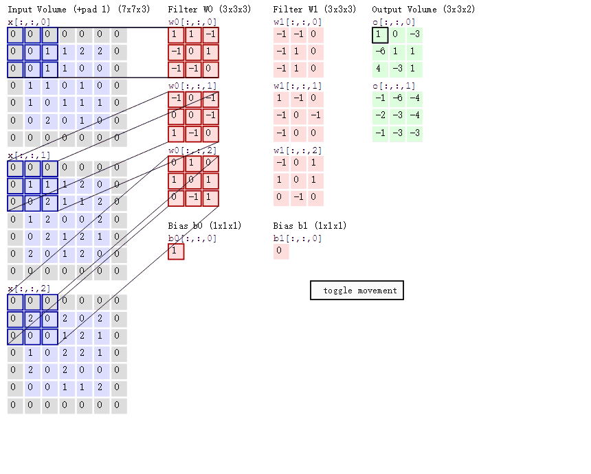
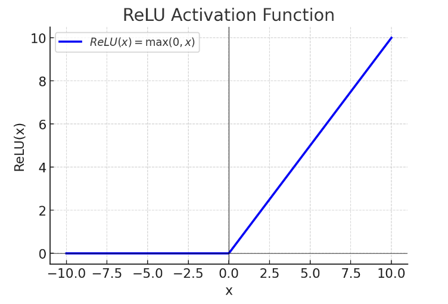

# 2.1. 卷积神经网络(CNN)模型理论(基础)：卷积运算、池化、ReLU函数

## 2.1.1. 计算量问题
我们提出MLP问题的初衷就是为了解决逻辑回归计算量过大的问题。

以手写识别(28乘28像素)来说：
- 三次多项式为决策边界的**逻辑回归**待训练的参数数量为80931145
- MLP模型(784个输入数据，两个隐藏层层各394个隐藏神经元，输出层10个神经元)的待训练参数数量为465706

但是这只是一张非常小的图片，而且是灰度图，如果对日常生活中长宽都在100像素以上的RGB三色图片，比如500乘400，进行二分类，我们会需要78558378个待训练参数。这个计算量还是太高了。

那有没有更节省计算量的方式呢？这就是卷积神经网络发挥作用的地方了。

## 2.1.2. 图像卷积运算
想一下，计算机在进行目标识别时主要是看什么？轮廓对吧。MLP计算量过大就是因为图中的轮廓过多，计算机算不过来。如果我们能**先提取出图片中主要的轮廓**(比较关键的信息)再让MLP进行分析就能大幅降低计算量。

提取出主要信息这一步就需要图像卷积运算(convolution)。图像卷积运算是指对**图像矩阵**与**滤波器矩阵**进行对应相乘再求和运算，转化得到新的矩阵。它的主要作用就是快速定位图像中某些边缘特征。

数学上，A与B的卷积通常表示为：
$$
A \ast B
$$
或：
$$
convolution(A, B)
$$

我们来举个例子：

我们有一个7乘7二维数组，代表一幅图片：
$$
A =

\begin{bmatrix}

X_{11} & X_{12} & X_{13} & X_{14} & X_{15} & X_{16} & X_{17} \\

X_{21} & X_{22} & X_{23} & X_{24} & X_{25} & X_{26} & X_{27} \\

X_{31} & X_{32} & X_{33} & X_{34} & X_{35} & X_{36} & X_{37} \\

X_{41} & X_{42} & X_{43} & X_{44} & X_{45} & X_{46} & X_{47} \\

X_{51} & X_{52} & X_{53} & X_{54} & X_{55} & X_{56} & X_{57} \\

X_{61} & X_{62} & X_{63} & X_{64} & X_{65} & X_{66} & X_{67} \\

X_{71} & X_{72} & X_{73} & X_{74} & X_{75} & X_{76} & X_{77}

\end{bmatrix}
$$

我们还有一个3乘3的滤波器：
$$
F =

\begin{bmatrix}

W_{11} & W_{12} & W_{13} \\

W_{21} & W_{22} & W_{23} \\

W_{31} & W_{32} & W_{33}

\end{bmatrix}
$$
我们进行$A \ast B$运算，会长这样(这个图进行了图像填充，但我们这里就当它是7乘7的原始大小，下一篇文章我们会讲图像填充（详见 [2.2. 卷积神经网络(CNN)模型理论(进阶)：图像填充、LeNet、AlexNet](<../2.2/2.2. 卷积神经网络(CNN)模型理论(进阶)：图像填充、LeNet、AlexNet.md>)）)：

滤波器就像是一个掩膜一样覆盖在图像上，遮盖到图像的哪里就对哪里进行卷积操作，逐个像素地移动。

假如滤波器现在在图像的左上角，覆盖：
$$
\begin{bmatrix}

X_{11} & X_{12} & X_{13} \\
X_{21} & X_{22} & X_{23} \\
X_{31} & X_{32} & X_{33} \\

\end{bmatrix}
$$
那么进行的卷积运算(相乘再求和)就是：
$$
Y_{11} = X_{11} W_{11} + X_{12} W_{12} + X_{13} W_{13} + X_{21} W_{21} + X_{22} W_{22} + X_{23} W_{23} + X_{31} W_{31} + X_{32} W_{32} + X_{33} W_{33}
$$

如果我们对整个矩阵进行卷积计算就会得到一个小一点(从7乘7到5乘5)的矩阵：
$$
Y = 
\begin{bmatrix} 
Y_{11} & Y_{12} & Y_{13} & Y_{14} & Y_{15} \\ 
Y_{21} & Y_{22} & Y_{23} & Y_{24} & Y_{25} \\ 
Y_{31} & Y_{32} & Y_{33} & Y_{34} & Y_{35} \\ 
Y_{41} & Y_{42} & Y_{43} & Y_{44} & Y_{45} \\ 
Y_{51} & Y_{52} & Y_{53} & Y_{54} & Y_{55} 
\end{bmatrix}
$$

## 2.1.3. 寻找指定特征
那么如何寻找图中特定的轮廓呢？

### 寻找竖向轮廓
假设我们有如下的一个图像像素矩阵，我们想要找它的竖向轮廓：
$$
A =

\begin{bmatrix}

20 & 20 & 20 & 0 & 0 & 0 \\

20 & 20 & 20 & 0 & 0 & 0 \\

20 & 20 & 20 & 0 & 0 & 0 \\

20 & 20 & 20 & 0 & 0 & 0 \\

20 & 20 & 20 & 0 & 0 & 0 \\

20 & 20 & 20 & 0 & 0 & 0

\end{bmatrix}
$$

我们可以修改过滤器矩阵的值：
$$
K =

\begin{bmatrix}

1 & 0 & -1 \\

1 & 0 & -1 \\

1 & 0 & -1

\end{bmatrix}
$$
这样的出来的卷积结果就是：
$$
\begin{bmatrix}

0 & 60 & 60 & 0 \\

0 & 60 & 60 & 0 \\

0 & 60 & 60 & 0 \\

0 & 60 & 60 & 0

\end{bmatrix}
$$
包含竖向轮廓的区域灰度值就非常高，在图像上就会被高亮突出。

### 寻找横向轮廓
那么寻找横向轮廓呢？

假设我们有如下的一个图像像素矩阵：
$$
A =

\begin{bmatrix}

20 & 20 & 20 & 20 & 20 & 20 \\

20 & 20 & 20 & 20 & 20 & 20 \\

20 & 20 & 20 & 20 & 20 & 20 \\

0 & 0 & 0 & 0 & 0 & 0 \\

0 & 0 & 0 & 0 & 0 & 0 \\

0 & 0 & 0 & 0 & 0 & 0

\end{bmatrix}
$$
直接把过滤器矩阵顺时针转90度就行：
$$
K =

\begin{bmatrix}

1 & 1 & 1 \\

0 & 0 & 0 \\

-1 & -1 & -1

\end{bmatrix}
$$
卷积出的结果是：
$$
\begin{bmatrix}

0 & 0 & 0 & 0 \\

60 & 60 & 60 & 60 \\

60 & 60 & 60 & 60 \\

0 & 0 & 0 & 0

\end{bmatrix}
$$

## 2.1.4. 卷积神经网络的核心
发现了吗？使用卷积找特征的核心在于确定过滤器的值。那我们该如何找到合适的过滤器值呢？这时候就需要结合神经网络了。

卷积神经网络的核心就是计算机根据样本图片，**自动寻找合适的轮廓过滤器**，对新图片进行轮廓匹配。

不仅如此，现实生活中很多图像都是RGB彩色图，我们可能会需要**多个过滤器**来寻找特征。RGB图像的卷积：对R\G\B三个通道分别求卷积再相加。

## 2.1.5. 池化层实现维度缩减
池化(Pooling)指的是按照一个固定规则对图像矩阵进行处理，将其**转换为更低维度的矩阵**。

最常用的规则只有两个：*最大法*和*平均法*。

---

### 最大法池化(Max-pooling)
最大化指的是在*指定大小的区域*（被称为池化尺寸）中选取最大的那个值作为代表这一整个区域的代表值。

比如说：
$$
\begin{bmatrix}

10 & 1 & 3 & 5 \\

2  & 9 & 8 & 1 \\

3  & 2 & 2 & 1 \\

5  & 7 & 3 & 6

\end{bmatrix}
$$
我们以2乘2为池化尺寸，以$(2, 2)$为窗口滑动步长(英文中称为Stride)。
- $(2, 2)$指的是扫描完一个区域之后横向移动2个单位，换行时纵向移动2个单位

最后的结果就是：
$$
\begin{bmatrix}

10 & 8 \\

7  & 6

\end{bmatrix}
$$

最大法池化的好处在于能够**保留核心的信息**。

---

### 平均法池化(Avg-pooling)
还是一样的数据：
$$
\begin{bmatrix}

10 & 1 & 3 & 5 \\

2  & 9 & 8 & 1 \\

3  & 2 & 2 & 1 \\

5  & 7 & 3 & 6

\end{bmatrix}
$$
平均池化法会在池化区域里**算所有值的平均值**作为这个区域的代表值。

如果我们依然以2乘2为池化尺寸，以$(2, 2)$为窗口滑动步长，这样算出来的结果是：
$$
\begin{bmatrix}

5.5 & 4.25 \\

4.25  & 3

\end{bmatrix}
$$

---

大多数情况下使用最大法池化最好，因为能够保持特征信息。

## 2.1.6. 卷积神经网络(Convolutional Neural Network)
这篇文章的标题是卷积神经网络，我们到现在都还没有提及到这个名字，那什么是到底什么是卷积神经网络呢？

卷积神经网络(Convolutional Neural Network，简称CNN)就是把我们上面涉及的一系列操作连接到一起形成的模型：
- 卷积
- 池化
- MLP

我们来举个例走全流程，假如我有如下数据：
$$
A =

\begin{bmatrix}

20 & 0 & 0 & 0 & 0 & 0 & 0 \\

20 & 0 & 0 & 0 & 0 & 0 & 0 \\

20 & 0 & 0 & 0 & 0 & 0 & 0 \\

0  & 0 & 0 & 0 & 0 & 0 & 0 \\

0  & 0 & 0 & 0 & 0 & 0 & 0 \\

0  & 0 & 0 & 0 & 0 & 0 & 0 \\

0  & 0 & 0 & 0 & 0 & 0 & 0

\end{bmatrix}
$$

然后我想要提取竖向轮廓，就使用竖向轮廓过滤器：
$$
K =

\begin{bmatrix}

1 & 0 & -1 \\

1 & 0 & -1 \\

1 & 0 & -1

\end{bmatrix}
$$
这样子卷积出来的值就是（7×7 输入、3×3 滤波器、无填充时得到 5×5 特征图）：
$$
\begin{bmatrix}

60 & 0 & 0 & 0 & 0 \\

40 & 0 & 0 & 0 & 0 \\

20 & 0 & 0 & 0 & 0 \\

0  & 0 & 0 & 0 & 0 \\

0  & 0 & 0 & 0 & 0

\end{bmatrix}
$$

然后我们以2乘2为池化尺寸，以$(2, 2)$为窗口滑动步长进行**最大法**池化，得出的结果是：
$$
\begin{bmatrix}

60 & 0 \\

20 & 0

\end{bmatrix}
$$
最后把二维数组展开成一维数组，再根据实际需求建立MLP模型即可。可以看到最底层仍然需要MLP，只是多了数据预处理降维操作。

需要注意的是，在完成卷积处理进行池化之前，我们一般还会使用激活函数，通过激活函数可以：
- 使部分神经元为0，防止过拟合
- 助于模型的求解

我们一般选用ReLU函数作为激活函数。

## 2.1.7. ReLU(Rectified Linear Unit)函数
ReLU函数本身非常简单：
$$
f(x) = max(x, 0)
$$

数据小于等于0时就取0，大于0就保持原数据不变。这样的特性可以：
- 让卷积层输出变得更加稀疏（许多值变为 0），减少冗余信息，使得后续池化层只关注有意义的激活
- 抑制噪声，减少负值带来的干扰，使模型更稳定

其实说到这里ReLU函数能做的逻辑函数(Sigmoid)也能做，那为什么不使用Sigmoid呢？这是为了防止梯度消失：
• **Sigmoid:** 在$x \to +\infty$或$x \to -\infty$时，梯度接近$0$，容易出现梯度消失
• **ReLU:** 只要$x > 0$，梯度为$1$，保持梯度流动

## 2.1.8. 卷积神经网络的两大特点
- 参数共享（parameter sharing）：同一个特征过滤器可用于整张图片
- 稀疏连接（sparsity of connections）：生成的特征图片每个节点只与原图片中特定节点连接
