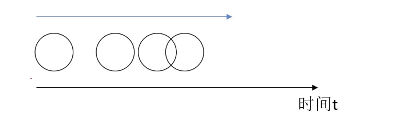
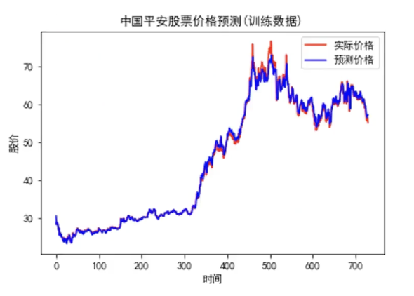

# 3.1. 序列模型(Sequence Model)

## 3.1.1. 一些案例
我们来看看序列模型的实际应用案例：
- 根据标题自动撰写文章
- 自动寻找语句中的人名
- ...

它们的共同核心点在于**基于文本内容及其前后信息进行预测**。

我们再来看一个例子：

有一个球在沿着一个方向运动，但是速度不固定，我希望计算机能预测在某一时刻小球所处的位置。如果我们有这种算法，那么就可以通过视觉监控预判出人的行为。

这个问题的核心在于**基于目标不同时刻状态进行预测**。

最后一个例子：

通过历史股价，预测次日股票价格。虽然不可能很精确的预测，但是只要趋势正确就能帮助投资者进行投资。

这个问题的核心在于**基于数据历史信息进行预测**。

---

这三个例子都有一个共同点：**根据一些有前后关系的序列数据进行预估**。

针对这一类问题有***序列模型***来解决。

## 3.1.2. 什么是序列模型(Sequence Model)
**序列模型（Sequence Models）** 是一类专门处理**时间序列数据或有序数据**的机器学习模型。它们能够捕捉**输入数据的时序依赖关系**，广泛应用于**自然语言处理（NLP）、语音识别、时间序列预测**等领域。

常见的序列模型包括：
- **RNN（循环神经网络）**：能够处理变长输入，但存在梯度消失问题。
- **LSTM（长短时记忆网络）** & **GRU（门控循环单元）**：改进 RNN，能够更好地捕捉长距离依赖关系。
- **Transformer**：基于自注意力机制（Self-Attention），在 NLP 任务中超越了 RNN/LSTM，成为当前主流架构（如 BERT、GPT）。

其主要特点是：
- 输入（输出）元素之间是具有顺序关系。不同的顺序，得到的结果应该是不同的，比如“不吃饭” 和“吃饭不”这两个短语的意思是不同的
- 输入输出不定长。比如文章生成、聊天机器人

其主要应用方面包括：
- 语音识别
- 语言翻译
- 股价预测
- 行为预测

一个冷知识：**Transformer**架构最初是为**自然语言处理（NLP）任务**设计的，尤其是用于**机器翻译（Machine Translation）**。它首次出现在 2017 年谷歌的论文 **“Attention Is All You Need”** 中，彻底改变了 NLP 领域。

下一篇文章 [3.2. 循环神经网络(RNN)理论(基础)](<../3.2/3.2. 循环神经网络(RNN)理论(基础).md>) 中我们就会学到前Transformer时代最常用的序列模型——RNN循环神经网络。