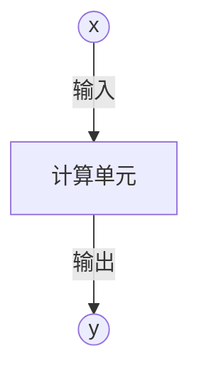
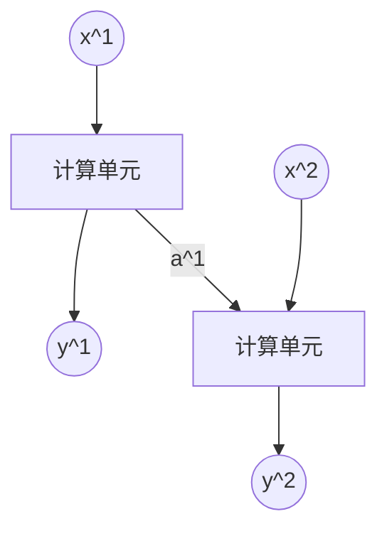
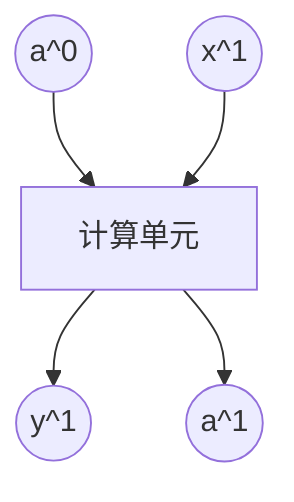

# 3.2. 循环神经网络(RNN)理论(基础)

## 3.2.1. 什么是循环神经网络(RNN)
**循环神经网络**（Recurrent Neural Network，简称RNN）是一种用于处理序列数据（如时间序列、文本、语音等）的神经网络。与普通前馈神经网络不同，RNN 具有 **“记忆”** 能力，能够保留过去的信息并影响当前的输出，非常适用于处理**时序数据**和**自然语言**相关任务。

为了理解RNN，我们需要先回顾一下多层感知器MLP模型，以下是一个简略模型：

`x`作为输入，交由计算单元中的各层若干个神经元计算输出结果`y`。而RNN就是把前一次计算的数据作为新一次计算的参数继续计算：

- $x^1$ 和 $x^2$ 是两个时间步的输入。
- 计算单元处理每个时间步的数据，输出 $y^1$ 和 $y^2$。
- **隐藏状态** $a^1$ **在时间步间传递**，即前一个时间步的信息流向下一个时间步。隐藏状态是通过 **前一个时间步的隐藏状态和当前输入** 计算得出的。

## 3.2.2. RNN数学模型
### 基础架构
我们来看RNN模型的基础架构：

### $a^0$: 初始隐藏状态
- 这是 **RNN 在第一个时间步的隐藏状态的初始值**。
- **通常设为零向量**（全零），或者可以随机初始化：$a^0 = \mathbf{0} \quad \text{(default)}$
- 作用：提供初始记忆，使 RNN 具有时间序列特性。

### $x^1$ : 第一时间步的输入
- RNN 处理的序列输入，第一个时间步的数据
- 可能是：
  - **文本任务**：句子的第一个单词（例如 “Hello”）
  - **时间序列**：股票数据的第一个时间点
  - **语音识别**：语音片段的第一帧
- 这个输入会和隐藏状态 $a^0$ 一起用于计算新的隐藏状态 $a^1$。

### 计算单元
- RNN 的核心单元，它使用 **前一个隐藏状态** $a^0$ **和当前输入** $x^1$ 计算出：
  - **新的隐藏状态** $a^1$（记忆传递）
  - **当前时间步的输出** $y^1$（预测）
- **计算公式：**
$$
a^1 = f(W_h a^0 + W_x x^1 + b)
$$
$$
y^1 = g(W_y a^1 + c)
$$
- $W_h$, $W_x$, $W_y$ 是权重矩阵
- $b$, $c$ 是偏置项
- $f$（常用tanh）是隐藏状态的激活函数
- $g$（如softmax）是输出的映射

本文采用上面这种常见写法：先更新隐藏状态 $a^1$，再由 $a^1$ 计算输出 $y^1$。有些资料会写成由 $a^0$ 与 $x^1$ 一步映射到 $y^1$ 的等价变体；只要权重矩阵定义一致，含义相同。

### $y^1$: 第一个时间步的输出
- 这是 **计算单元的主要输出**，表示当前时间步的预测结果
- 对于不同任务：
  - 语言模型（如 GPT）：$y^1$ 可能是 **预测下一个单词的概率分布**
  - 机器翻译：$y^1$ 可能是 **目标语言的第一个单词**
  - 语音识别：$y^1$ 可能是 **音素（phoneme）** 或 **单词**
- **计算公式：**
$$
y^1 = g(W_y a^1 + c)
$$
  - 其中 g 可能是 **softmax（分类任务）**，或者是线性激活（回归任务）

### $a^1$:更新后的隐藏状态
- **下一时间步的记忆信息**，用于传递历史信息到 $t=2$
- **计算公式：**
$$
a^1 = f(W_h a^0 + W_x x^1 + b)
$$
  - 这个值会传递到下一个时间步 $t=2$，用于计算 $a^2$ 和 $y^2$

### 以此类推
最关键的两个公式就是计算两个输出的公式：
$$
a^1 = f(W_h a^0 + W_x x^1 + b)
$$
$$
y^1 = g(W_y a^1 + c)
$$
- $W_h$, $W_x$, $W_y$ 是权重矩阵
- $b$, $c$ 是偏置项
- $f$（常用tanh）是隐藏状态的激活函数
- $g$（如softmax）是输出的映射

我们要做的就是重复这个过程，不断循环：
$$
a^i = f(W_h a^{i-1} + W_x x^{i} + b)
$$
$$
y^i = g(W_y a^i + c)
$$

## 3.2.3. 计算机与RNN
那么我们要计算机在RNN模型算什么呢？仔细看上面的两行公式，不知道的参数有权重矩阵$W_h$, $W_x$和$W_y$。

计算这几个参数的方法跟MLP的求解方法一样：通过训练数据和标签来反推梯度，求到权重矩阵$W_h$, $W_x$和$W_y$，使损失函数最小。

## 3.2.4. 例子
我们用一个例子来加深对RNN的理解：

>自动寻找语句中的人名：GTC is hosted by Jensen Huang.

我们先来确定我们的输入——每一个单词（标点也算）对应一个输入数据：

| 输入    | 单词       |
| ----- | -------- |
| $x_1$ | "GTC"    |
| $x_2$ | "is"     |
| $x_3$ | "hosted" |
| $x_4$ | "by"     |
| $x_5$ | "Jensen" |
| $x_6$ | "Huang"  |
| $x_7$ | "."      |

 那标签该怎么写呢？每一个输入对应一个输出，既然我们要找人名，那么是人名的输入就是1，不是则为0:

| 输入    | 单词       | 输出  |
| ----- | -------- | --- |
| $x_1$ | "GTC"    | 0   |
| $x_2$ | "is"     | 0   |
| $x_3$ | "hosted" | 0   |
| $x_4$ | "by"     | 0   |
| $x_5$ | "Jensen" | 1   |
| $x_6$ | "Huang"  | 1   |
| $x_7$ | "."      | 0   |

但是计算机也不懂单词啊，它看到的单词只是编码，所以我们得把单词转为计算机能看懂的形式——数字，也就是建立一个字典，把输入词汇转为数值矩阵，把单词输入转为字典里的数值。

那我们该怎么写这个字典呢？最简单粗暴的办法就是创建一个涵盖了所有单词的字典（首字母大写小写的两种格式要分为两个字段）：
$$
\left\{
\begin{array}{ll}
\textit{a} & : 1 \\
\textit{am} & : 2 \\
\vdots & \vdots \\
\textit{by} & : x \\
\vdots & \vdots \\
\textit{is} & : y \\
\textit{hosted} & : z \\
\vdots & \vdots
\end{array}
\right\}
$$

我们会把单词对应的one-hot编码作为输入，比如am这个单词就会表达成：

| 索引  | 值   |
| --- | --- |
| 0   | 0   |
| 1   | 1   |
| 2   | 0   |
| 3   | 0   |
| 4   | 0   |
| 5   | 0   |
| ... | 0   |

那如何构建模型呢？

7个输入对应7个时间步（同一个 RNN 单元及其权重在各时间步复用）。把one-hot编码好的数据和对应标签给模型，让模型反推权重即可。

计算机在反推权重时会需要保证损失函数最小，单个神经元的损失函数计算公式如下：
$$
\textit{loss}(i) = -y^i \log(y_{\textit{predict}}^i) - (1 - y^i) \log(1 - y_{\textit{predict}}^i)
$$
我们把所有神经元的损失函数加一起，让计算机在每次迭代中都尽可能使它最小即可：
$$
\operatorname{minimize}( \sum_{i} \left[ -y^i \log(y_{\textit{predict}}^i) - (1 - y^i) \log(1 - y_{\textit{predict}}^i) \right])
$$
---

如果你不想建立一个包含所有英文单词的字典，也可以建立一个针对每个字母的字典：
$$
\left\{
\begin{array}{ll}
\textit{a} & : 1 \\
\textit{b} & : 2 \\
\vdots & \vdots \\
\textit{z} & : 26 \\
\textit{A} & : 27 \\
\vdots & \vdots \\
\textit{1} & : 53 \\
\vdots & \vdots
\end{array}
\right\}
$$
这么写字典更小，但是对模型要求更高。