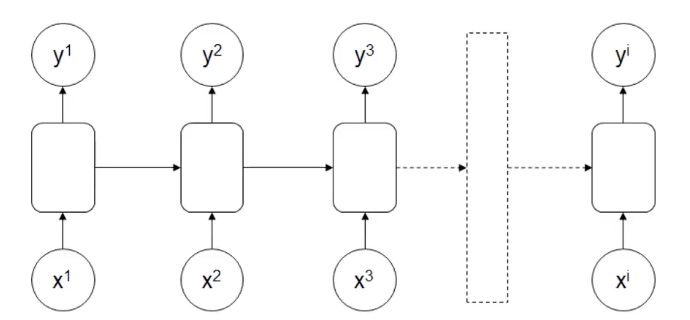
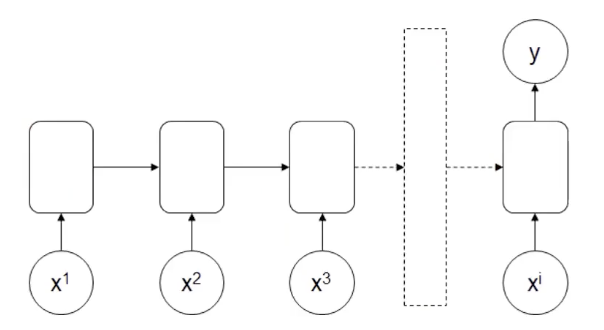
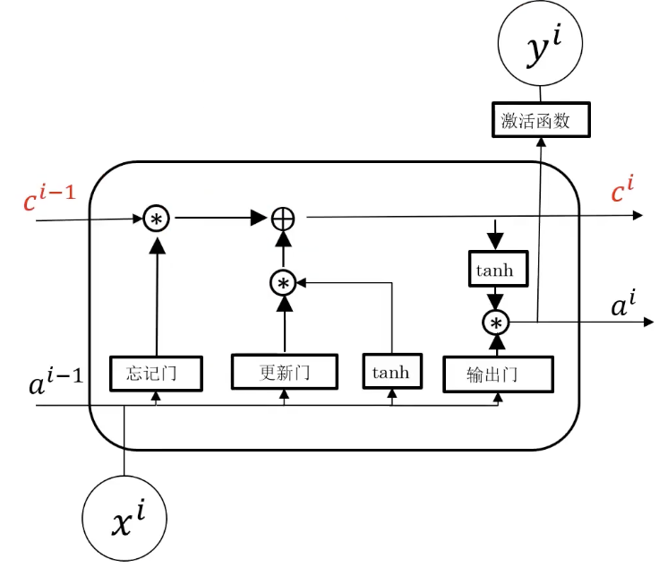
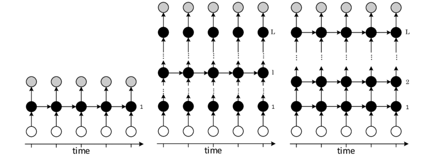

# 3.3. 循环神经网络(RNN)理论(进阶)

本文承接自上一篇文章 [3.2. 循环神经网络(RNN)理论(基础)](<../3.2/3.2. 循环神经网络(RNN)理论(基础).md>)，没看过的建议先看上文。

## 3.3.1. 基础的RNN结构
### 图示
我们先来看最基础的RNN结构：

在MLP的基础上把前面序列的部分信息作处理之后给下一个序列。

有的时候你也会看到这样的符号：

这是对应基础的RNN结构，可以用来表示RNN模型，相比于MLP多了一个表示自循环的箭头。

### 输入&输出
- 输入： $x^1, x^2, x^3, \dots, x^i$
- 输出： $y^1, y^2, y^3, \dots, y^i$

特点在于输入输出的序列是一样的，输入有$i$个输出就有$i$个。这就是**多输入对应多输出、维度相同**的RNN结构。

### 主要应用
特定信息识别，比如说判断句子中的哪些单词是人名。

## 3.3.2. 多输入单输出的RNN架构
### 图示

### 输入&输出
- 输入： $x^1, x^2, x^3, \dots, x^i$
- 输出： $y^1$

### 主要应用
情感识别：假如我有"I feel happy and positive."这句话，计算机需要判定这句话表达的是正面情绪还是负面情绪。

## 3.3.3. 单输入多输出的RNN架构
### 图示

### 输入&输出
- 输入： $x^1$
- 输出： $y^1, y^2, y^3, \dots, y^i$

它一般作为**序列数据生成器**。

### 主要应用
- 文章生成：给个标题生成一段话。
- 音乐生成：选定曲风/情感之类的参数来输出音乐。

## 3.3.4. 多输入多输出的RNN架构
### 图示

它与基础RNN架构有什么不同吗？不同之处在于输入数据的数量与输出数据可以不保持一致。

### 输入&输出
- 输入： $x^1, x^2, x^3, \dots, x^i$
- 输出： $y^1, y^2, y^3, \dots, y^j$

### 主要应用
其主要应用是语言翻译（虽然现在Transformer已经基本取代了RNN），比如说我有下面这句话：
*"What is artificial intelligence?"*(4个单词，不算标点)

计算机把它翻译为中文：
*"什么是人工智能？"*(7个汉字，不算标点)

这里的输入输出单词数不一致。

## 3.3.5. 普通RNN结构缺陷
普通RNN都存在结构缺陷。前部序列信息在传递到后部的同时，信息权重下降，导致重要信息丢失。

我们来看一个简单的例子(使用过去式填空)：

1. *"The student, who got A+ in the exam, ___ excellent."*
2. *"The students, who got A+ in the exam, ___ excellent."*

第一个题(关键字：“student”)很明显是填*was*，第二个题(关键字：“students”)很明显是填*were*。

但是循环神经网络会在每一次传递中损失信息，最后“student”和“students”的差别就不会被体现。

针对这个问题，我们需要提高前部特定信息的决策权重。

## 3.3.6. 长短期记忆网络(LSTM)简介
### 图示

### 特点
增加了记忆细胞$c^i$，可以传递前部远处部位信息。比如说上文的“student”和“students”的单复数差别就能被记忆细胞记住。

简化理解：相比$a^i$，记忆细胞$c^i$重点记录前部序列重要信息，且在传递过程中信息丢失少。

## 3.3.7. 深入理解LSTM

**1. 输入与输出**
- **输入：** 该 LSTM 单元的输入包括：
- 当前时刻的输入 $x^i$
- 上一时刻的隐藏状态 $a^{i-1}$
- 上一时刻的细胞状态 $c^{i-1}$（红色标注）

- **输出：**
  - 当前时刻的隐藏状态 $a^i$
  - 当前时刻的细胞状态 $c^i$（红色标注）
  - 经过激活函数后的输出 $y^i$

**2. 关键计算单元**
LSTM 的关键组件是 **遗忘门、输入门、输出门**，以及一个新的细胞状态计算方式：

**(1) 遗忘门（Forget Gate）**
- 作用：决定哪些信息应该从过去的细胞状态 $c^{i-1}$ 中遗忘。
- 计算方式：
$$
f^i = \sigma(W_f [a^{i-1}, x^i] + b_f)
$$
  - 其中：$\sigma$ 是 Sigmoid 激活函数
  - $W_f$ 是权重矩阵，$b_f$ 是偏置项
  - 计算出的$f^i$介于0和1之间，表示遗忘的比例

**(2) 输入门（Input Gate）**
- 作用：决定哪些新的信息应该被加入到细胞状态中。
- 计算方式：
$$
g^i = \tanh(W_g [a^{i-1}, x^i] + b_g)
$$
  - 其中 $g^i$ 代表新信息（候选细胞状态），使用 tanh 进行归一化。

- 同时，另一个门控机制决定了信息加入的比例：
$$
i^i = \sigma(W_i [a^{i-1}, x^i] + b_i)
$$
  - $i^i$ 也是 Sigmoid 计算出的值，表示该信息对新细胞状态的影响程度。

细胞状态更新：
$$
c^i = f^i \cdot c^{i-1} + i^i \cdot g^i
$$
  

**(3) 输出门（Output Gate）**
- 作用：决定当前隐藏状态（即 a^i）的值。
- 计算方式：
$$
o^i = \sigma(W_o [a^{i-1}, x^i] + b_o)
$$
  - 其中 $o^i$ 控制了输出的程度。

计算最终的隐藏状态：
$$
a^i = o^i \cdot \tanh(c^i)
$$

**3. 关键连线说明**
- 红色的 $c^i$ 和 $c^{i-1}$ 表示 LSTM 细胞状态的传递
- $a^i$ 和 $a^{i-1}$ 是隐藏状态的传递，供下一时刻使用
- 输入 $x^i$ 通过多个门控制其信息流
- 激活函数（如 tanh）在细胞状态和输出门中起到了归一化作用

## 3.3.8. 深层循环网络(DRNN)
解决更复杂的序列任务，可以把单层RNN叠起来或者在输出前和普通MLP结构结合使用：

**1. 左图：单层RNN**
- 这是最基本的RNN结构，输入依赖于时间步（time step），并且隐藏层通过时间传播信息
- 黑色节点表示隐藏状态，箭头表示信息流动的方向
- 由于仅有单层隐藏层，该结构在建模复杂序列时存在局限性 

**2. 中图：多层RNN**
- 这一结构在**时间维度**上保持RNN特性，同时在**深度方向**上叠加了多个隐藏层
- 低层的隐藏状态不仅连接到下一个时间步，还作为输入传递到上层隐藏状态，使模型可以在不同层次学习不同级别的表示（低层学习局部模式，高层学习长期依赖）
- 这使得模型更具表达能力，能够提取更复杂的特征

**3. 右图：全连接的深度RNN**
- 该结构进一步增强了网络的建模能力，每一层的隐藏状态都与下一层进行连接，并且在时间步之间进行传播
- 这种结构能够更好地捕捉长期依赖关系，同时利用深度结构提升特征学习能力

**DRNN的关键特性**
- **深度结构**：相比单层RNN，DRNN具有多个隐藏层，使得模型在不同层级上学习不同的特征表示，提升表达能力
- **更强的特征学习能力**：堆叠多层有助于网络学习层次化的时序特征。沿时间和深度方向仍可能出现梯度消失，实践中常配合 LSTM/GRU 单元或残差连接使用
- **信息流的层次化传播**：信息在不同时间步和不同层之间进行传播，提高模型的预测能力
我们会在之后的实战环节进行更深入的了解